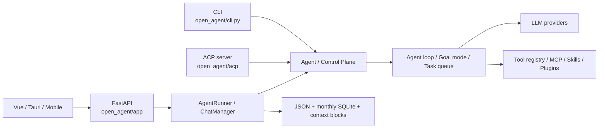

# Architecture and Ownership

## System shape

OpenAgentSeal is a local-first Python agent runtime delivered through CLI, ACP, a FastAPI web server, a Vue browser UI, a Tauri desktop shell, and a Capacitor Android companion. It is one repository with several entry surfaces, not a conventional three-tier web service.



## Ownership map

| Area | Current owner |
|---|---|
| Core turn/tool loop | `open_agent/agent.py` |
| CLI composition and interactive commands | `open_agent/cli.py`, `cli_commands.py`, `cli_sessions.py`, `cli_ui.py` |
| Multi-agent coordination | `open_agent/master_agent.py`, `agent_service.py`, `agent_control.py` |
| Durable goal state | `open_agent/goal_mode.py`, `control_plane.py` |
| Task scheduling | `open_agent/task_queue/` |
| LLM abstraction/providers | `open_agent/llm/`, `provider_registry.py`, `retry.py` |
| Tools, safety metadata, MCP, Skills | `open_agent/tools/` |
| Plugin marketplace/runtime projection | `open_agent/plugins/manager.py` |
| Web composition root and general routes | `open_agent/app/_app.py` |
| Chat/session runtime | `open_agent/app/runner/` |
| Workspace and sandbox APIs | `open_agent/app/runner/workspace_api.py`, `open_agent/app/sandbox.py` |
| Mobile pairing/access | `open_agent/app/mobile.py` |
| Vue application | `open_agent/app/web/src/` |
| Desktop host | `desktop/src-tauri/` |
| Release orchestration | `scripts/package-release.mjs` |

## Composition roots

- `open_agent.cli:main` is registered as both `open-agent` and `open-agent-cli`. `run_unified()` selects interactive/web behavior and assembles configuration, LLM clients, tools, MCP connections, workspace access, and session state.
- `open_agent.app._app.create_app()` creates FastAPI, attaches runner/workspace/sandbox/mobile routers, general settings/provider/plugin routes, optional MinerU MCP, and packaged static files.
- `open_agent.app.runner.runner.AgentRunner` adapts the core Agent to persistent chat sessions and streams `AgentEvent` objects.
- `open_agent.acp.server:main` is the ACP entry point and reuses the runtime rather than defining a separate agent engine.
- `open_agent/app/web/src/main.ts` mounts Vue and Pinia. `App.vue`, `DesktopApp.vue`, and `MobileShell.vue` select the UI surface.
- `desktop/src-tauri/src/main.rs` starts/controls the packaged Python sidecar and hosts the web assets.

## Main chat path

```text
ChatPanel -> chat Pinia store -> runAgentStream()
  -> POST /api/run (SSE)
  -> runner/api.py::run_agent()
  -> AgentRunner.run_stream()
  -> Agent execution callbacks / tool calls / context compaction
  -> AgentEvent persisted to runtime thread/turn storage
  -> SSE data frames
  -> chat store updates messages, thinking, tools and terminal state
```

Mobile uses authenticated `/api/mobile/*` routes and its own streaming helper, but ultimately consumes the same chat/runner concepts. Sandbox terminals use WebSocket; normal chat authority is SSE, not the sandbox socket.

## Current structural facts and debt

- `open_agent/app/_app.py`, `open_agent/app/runner/runner.py`, `open_agent/cli.py`, and the frontend `api/index.ts` are large mixed-responsibility modules. New work normally extends them or extracts a coherent feature; do not claim they are already clean layered services.
- API responses are mixed: direct objects, `success`, `ok`, and streaming events coexist.
- State is intentionally mutable in Agent, task, queue, repository cache, Pinia, and Vue code.
- Persistence is local JSON/SQLite; there is no ORM or central database migration system.
- `open_agent/skills` is a Git submodule containing executable/model-visible Skill content. It is not the application package root.
