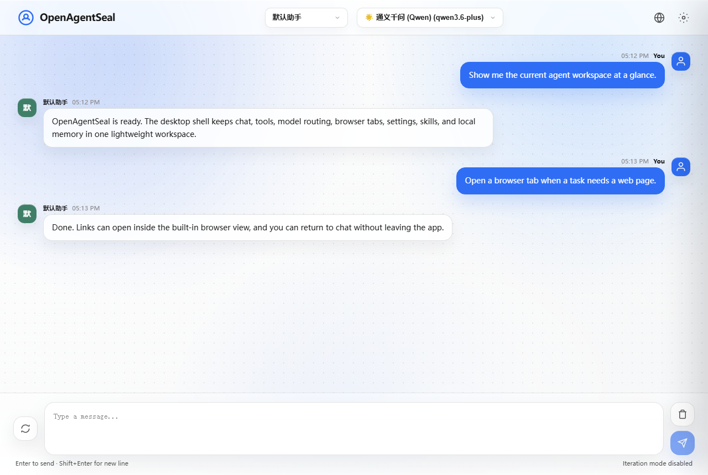
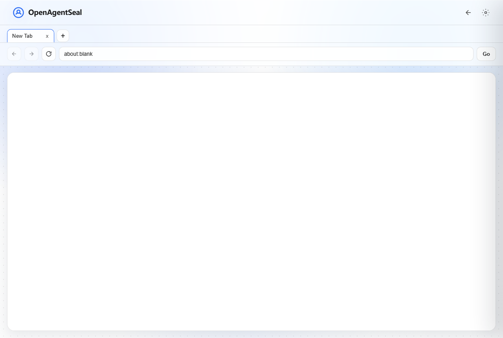
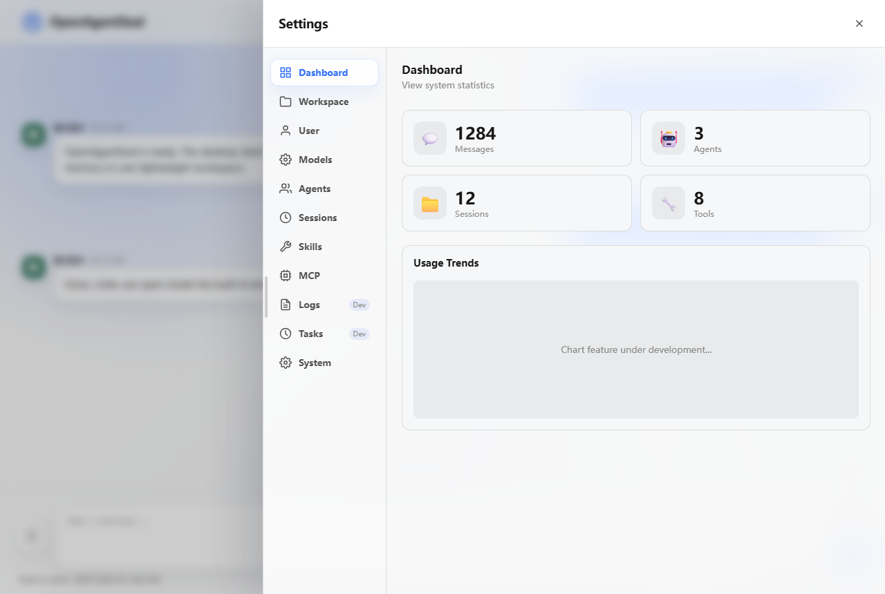

# OpenAgentSeal

移动端连接与 Android APK 构建说明见 [docs/mobile_shell.md](docs/mobile_shell.md)。

<div align="center">

   

**Language / 语言**

[English](./README.en.md) | [中文](./README.zh-CN.md)

</div>

## Screenshots / 界面预览

### Chat Workspace / 聊天工作区



### Built-in Browser / 内置浏览器



### Settings Panel / 设置面板



---

## English

OpenAgentSeal is a Python-first AI Agent framework with a complete agent execution loop, tool system, memory system, multi-LLM configuration, Web UI, and a lightweight Tauri desktop shell.

It is designed for building local-first agent applications that can run as:

- an interactive CLI assistant
- a FastAPI + Vue Web UI
- Windows and Linux x64 desktop applications with tray integration
- standalone Windows and Linux x64 CLI distributions
- an ACP-compatible agent service
- a tool-using agent runtime with MCP and skills support

Read the full English documentation: [README.en.md](./README.en.md)

## 中文

OpenAgentSeal 是一个以 Python 为核心的 AI Agent 框架，包含完整的 Agent 执行循环、工具系统、记忆系统、多模型配置、Web UI，以及轻量 Tauri 桌面壳。

它适合用来构建本地优先的 Agent 应用，可运行在多种形态下：

- 交互式 CLI 助手
- FastAPI + Vue Web UI
- 带系统托盘的 Windows 与 Linux x64 桌面应用
- 独立运行的 Windows 与 Linux x64 CLI 发行包
- ACP 兼容 Agent 服务
- 支持 MCP 和 Skills 的工具调用运行时

查看完整中文文档：[README.zh-CN.md](./README.zh-CN.md)

---

## Quick Start

```bash
git clone https://github.com/ASunYC/OpenAgentSeal.git
cd OpenAgentSeal
uv sync
open-agent
```

Start the CLI explicitly:

```bash
open-agent-cli
```

Start the Web UI:

```bash
open-agent --web-only --port 9998
```

Linux Web-only source setup:

```bash
bash scripts/linux/install.sh
bash scripts/linux/start-web.sh
```

See [README_LINUX.md](./README_LINUX.md).

Start the desktop shell:

```bash
cd desktop
npm install
npm run dev
```

Build Windows x64 desktop, CLI, and the Android companion APK incrementally with
`npm run build`, or build Linux x64 desktop and CLI plus the host-built Android APK
with `npm run build:linux:docker`.
Use `npm run build:clean` only when a full local rebuild is required.

## Links

- English docs: [README.en.md](./README.en.md)
- 中文文档: [README.zh-CN.md](./README.zh-CN.md)
- Desktop shell notes: [desktop/README.md](./desktop/README.md)
- Autonomous runtime operations: [docs/autonomous-runtime-operations.md](./docs/autonomous-runtime-operations.md)
- Built-in long-lived messaging connectors: Discord Gateway, DingTalk Stream, QQ Bot Gateway, and WeCom AI Bot WebSocket (see the operations capability matrix)
- License: [LICENSE](./LICENSE)
