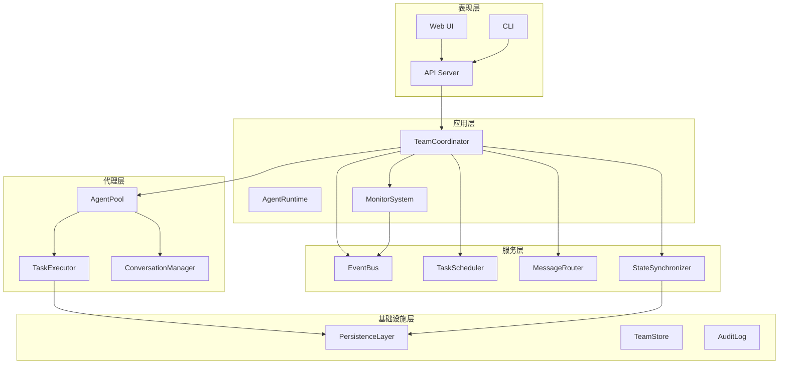
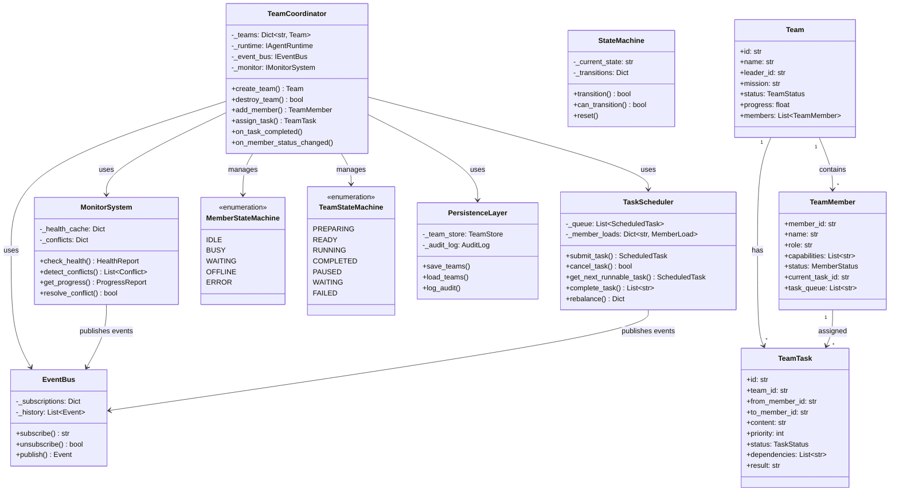
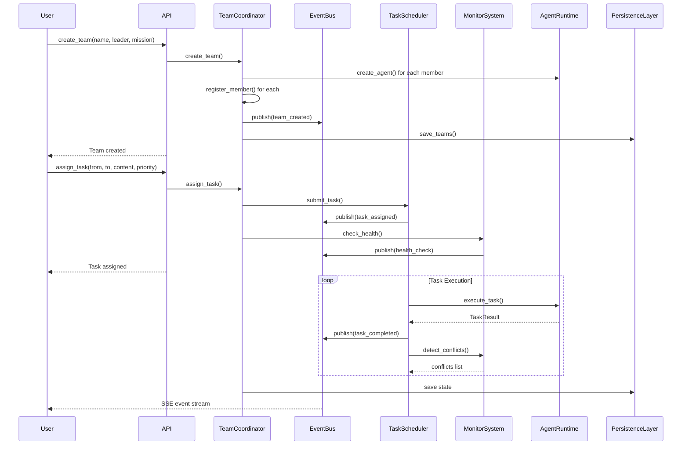
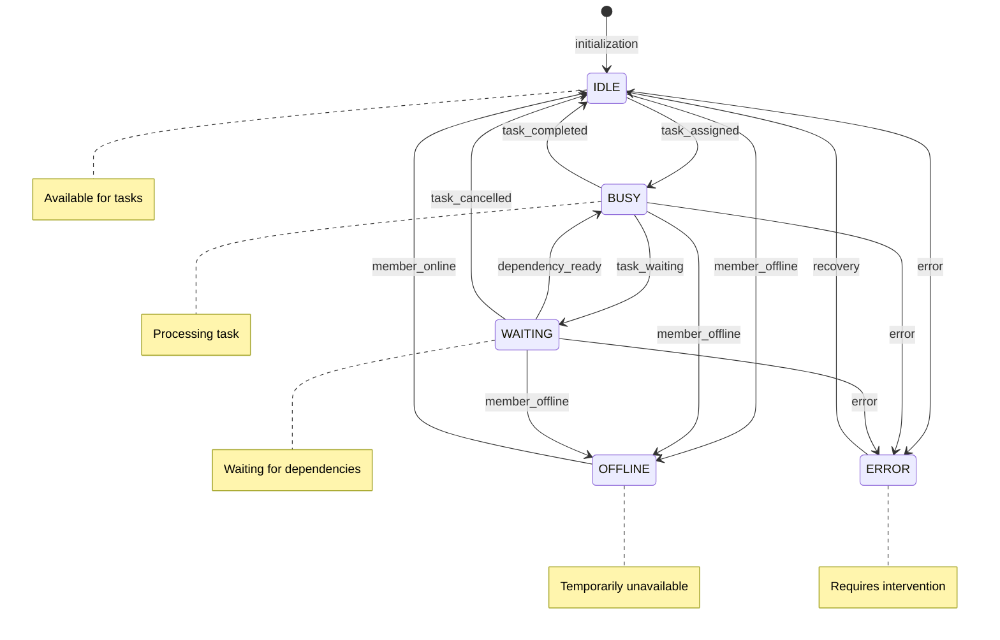
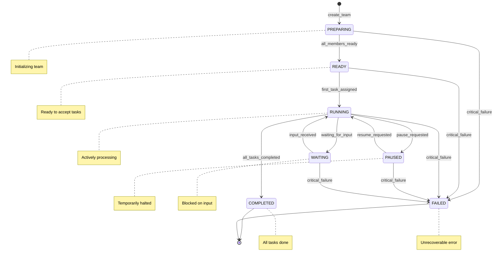
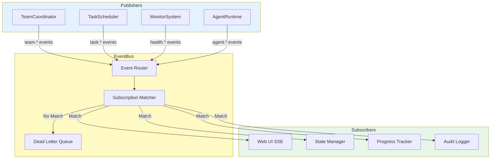

# 智能小组协作系统 - 技术架构设计文档

## 文档信息
- **版本**: v1.0
- **日期**: 2026-03-24
- **状态**: 设计中

---

## 一、项目现状分析

### 1.1 已有组件
```
open_agent/
├── agent.py              # 基础智能体 (Agent)
├── master_agent.py       # 主智能体 (MasterAgent)
├── agent_service.py      # 智能体管理服务
├── team_service.py       # 小组服务 (基础版)
├── task_queue/
│   ├── task.py          # 任务数据结构
│   ├── queue.py         # 任务队列
│   ├── dispatcher.py    # 任务分发器
│   └── worker.py        # 工作池
├── sub_agent/
│   ├── manager.py       # 子智能体管理器
│   └── roles.py        # 子智能体角色
└── app/
    └── runner/
        ├── manager.py   # 运行器管理
        ├── runner.py    # AgentRunner
        └── api.py       # API路由
```

### 1.2 现有能力
| 组件 | 能力 |
|------|------|
| Agent | 单智能体执行、工具调用、MCP支持 |
| MasterAgent | 任务队列、子智能体管理 |
| TaskDispatcher | 任务分发、优先级调度、并行执行 |
| TaskQueue | 任务排队、状态跟踪 |
| SubAgentManager | 子智能体生命周期管理 |
| TeamService | 小组CRUD、成员管理、消息存储 |

### 1.3 待完善功能
- ❌ 事件驱动架构 (EventBus)
- ❌ 任务调度器 (TaskScheduler)
- ❌ 冲突检测与解决
- ❌ 健康检查与故障转移
- ❌ 检查点保存与恢复
- ❌ 实时状态同步 (WebSocket/SSE)
- ❌ 动态工作分配策略
- ❌ 成员状态机

---

## 二、系统架构设计

### 2.1 整体架构图



### 2.2 模块职责

| 模块 | 职责 |
|------|------|
| **TeamCoordinator** | 团队协调中枢，负责创建/销毁团队、分配任务、同步状态 |
| **AgentRuntime** | 智能体运行时，管理智能体池、任务执行、会话管理 |
| **EventBus** | 事件总线，发布-订阅模式，支持同步/异步事件 |
| **TaskScheduler** | 任务调度器，基于优先级和依赖关系调度任务 |
| **MonitorSystem** | 监控系统，健康检查、冲突检测、进度追踪 |
| **MessageRouter** | 消息路由，团队内部消息路由、@提及解析 |
| **StateSynchronizer** | 状态同步器，多实例状态同步、最终一致性 |
| **AgentPool** | 智能体池，智能体实例管理、复用、生命周期 |
| **TaskExecutor** | 任务执行器，负责任务的实际执行 |
| **ConversationManager** | 会话管理器，管理团队内部和私聊会话 |
| **PersistenceLayer** | 持久化层，数据存储、恢复、检查点 |
| **TeamStore** | 团队数据存储 |
| **AuditLog** | 审计日志 |

---

## 三、核心模块详细设计

### 3.1 TeamCoordinator (协调器)

```python
# open_agent/team/coordinator.py

from dataclasses import dataclass, field
from datetime import datetime
from enum import Enum
from typing import (
    Any, Callable, Dict, List, Optional, 
    Awaitable, Protocol, TypeVar
)
from uuid import UUID, uuid4

class TeamStatus(Enum):
    """团队状态"""
    PREPARING = "preparing"    # 准备中
    READY = "ready"           # 就绪
    RUNNING = "running"       # 进行中
    COMPLETED = "completed"    # 已完成
    PAUSED = "paused"         # 暂停
    WAITING = "waiting"       # 等待中
    FAILED = "failed"         # 失败

class MemberStatus(Enum):
    """成员状态"""
    IDLE = "idle"             # 空闲
    BUSY = "busy"             # 忙碌
    WAITING = "waiting"       # 等待中
    OFFLINE = "offline"       # 离线
    ERROR = "error"           # 错误

@dataclass
class TeamConfig:
    """团队配置"""
    max_retries: int = 3
    task_timeout: float = 300.0  # 秒
    heartbeat_interval: float = 30.0
    health_check_interval: float = 60.0
    conflict_resolution_timeout: float = 10.0
    checkpoint_interval: float = 60.0

@dataclass
class Team:
    """团队"""
    id: str
    name: str
    leader_id: str
    mission: str
    status: TeamStatus = TeamStatus.PREPARING
    progress: float = 0.0
    members: List['TeamMember'] = field(default_factory=list)
    created_at: datetime = field(default_factory=datetime.now)
    updated_at: datetime = field(default_factory=datetime.now)
    config: TeamConfig = field(default_factory=TeamConfig)
    
    def to_dict(self) -> Dict[str, Any]:
        ...

@dataclass
class TeamMember:
    """团队成员"""
    member_id: str
    name: str
    role: str
    capabilities: List[str] = field(default_factory=list)
    status: MemberStatus = MemberStatus.IDLE
    avatar: str = "🤖"
    current_task_id: Optional[str] = None
    task_queue: List[str] = field(default_factory=list)  # task IDs
    joined_at: datetime = field(default_factory=datetime.now)
    last_heartbeat: datetime = field(default_factory=datetime.now)
    
    def to_dict(self) -> Dict[str, Any]:
        ...

class IAgentRuntime(Protocol):
    """智能体运行时接口"""
    
    async def execute_task(
        self, 
        agent_id: str, 
        task: 'TeamTask'
    ) -> 'TaskResult': ...
    
    async def create_agent(
        self,
        name: str,
        role: str,
        capabilities: List[str]
    ) -> str: ...
    
    async def destroy_agent(self, agent_id: str) -> bool: ...
    
    async def get_agent_status(self, agent_id: str) -> MemberStatus: ...

class IEventBus(Protocol):
    """事件总线接口"""
    
    def subscribe(
        self, 
        event_type: str, 
        handler: Callable[[Any], Awaitable[None]]
    ) -> str: ...
    
    def unsubscribe(self, subscription_id: str) -> None: ...
    
    async def publish(
        self, 
        event_type: str, 
        data: Dict[str, Any]
    ) -> None: ...

class IMonitorSystem(Protocol):
    """监控系统接口"""
    
    async def check_health(self, team_id: str) -> Dict[str, Any]: ...
    
    async def detect_conflicts(self, team_id: str) -> List['Conflict']: ...
    
    async def get_progress(self, team_id: str) -> float: ...

class TeamCoordinator:
    """团队协调器
    
    核心职责：
    1. 团队生命周期管理
    2. 任务分配与调度
    3. 成员状态管理
    4. 事件协调
    """
    
    _instance: Optional['TeamCoordinator'] = None
    
    def __init__(
        self,
        runtime: IAgentRuntime,
        event_bus: IEventBus,
        monitor: IMonitorSystem,
        config: Optional[TeamConfig] = None
    ):
        self._runtime = runtime
        self._event_bus = event_bus
        self._monitor = monitor
        self._config = config or TeamConfig()
        
        # 团队注册表
        self._teams: Dict[str, Team] = {}
        
        # 成员注册表 member_id -> team_id
        self._member_to_team: Dict[str, str] = {}
        
        # 任务注册表 task_id -> TeamTask
        self._tasks: Dict[str, 'TeamTask'] = {}
        
        # 订阅者回调
        self._callbacks: Dict[str, List[Callable]] = {
            'task_completed': [],
            'member_status_changed': [],
            'conflict_detected': [],
            'team_status_changed': [],
            'progress_updated': [],
        }
        
        # 锁
        self._lock = threading.RLock()
    
    # ==================== 团队生命周期管理 ====================
    
    async def create_team(
        self,
        name: str,
        leader_id: str,
        mission: str,
        member_configs: Optional[List[Dict[str, Any]]] = None
    ) -> Team:
        """创建团队
        
        Args:
            name: 团队名称
            leader_id: 组长ID
            mission: 团队使命/任务描述
            member_configs: 成员配置列表
            
        Returns:
            Team: 创建的团队对象
        """
        team_id = f"team_{uuid4().hex[:8]}"
        
        # 创建成员列表
        members = []
        member_configs = member_configs or []
        
        # 添加组长
        leader = TeamMember(
            member_id=leader_id,
            name=f"Leader-{leader_id}",
            role="组长",
            capabilities=["任务分配", "进度跟踪", "决策"],
            status=MemberStatus.IDLE
        )
        members.append(leader)
        self._member_to_team[leader_id] = team_id
        
        # 创建其他成员
        for cfg in member_configs:
            member_id = cfg.get("member_id") or f"member_{uuid4().hex[:8]}"
            member = TeamMember(
                member_id=member_id,
                name=cfg.get("name", f"Member-{member_id}"),
                role=cfg.get("role", "成员"),
                capabilities=cfg.get("capabilities", []),
                status=MemberStatus.IDLE
            )
            members.append(member)
            self._member_to_team[member_id] = team_id
            
            # 创建智能体
            await self._runtime.create_agent(
                name=member.name,
                role=member.role,
                capabilities=member.capabilities
            )
        
        # 创建团队
        team = Team(
            id=team_id,
            name=name,
            leader_id=leader_id,
            mission=mission,
            status=TeamStatus.READY,
            members=members
        )
        
        with self._lock:
            self._teams[team_id] = team
        
        # 发布事件
        await self._event_bus.publish("team_created", {
            "team_id": team_id,
            "team": team.to_dict()
        })
        
        return team
    
    async def destroy_team(self, team_id: str) -> bool:
        """销毁团队
        
        Args:
            team_id: 团队ID
            
        Returns:
            bool: 是否成功
        """
        with self._lock:
            if team_id not in self._teams:
                return False
            
            team = self._teams[team_id]
            
            # 销毁所有成员智能体
            for member in team.members:
                if member.member_id != team.leader_id:
                    await self._runtime.destroy_agent(member.member_id)
                del self._member_to_team[member.member_id]
            
            # 清理任务
            team_task_ids = [
                t.id for t in self._tasks.values() 
                if t.team_id == team_id
            ]
            for task_id in team_task_ids:
                del self._tasks[task_id]
            
            # 删除团队
            del self._teams[team_id]
        
        await self._event_bus.publish("team_destroyed", {"team_id": team_id})
        return True
    
    async def get_team(self, team_id: str) -> Optional[Team]:
        """获取团队"""
        return self._teams.get(team_id)
    
    async def list_teams(self) -> List[Team]:
        """列出所有团队"""
        return list(self._teams.values())
    
    # ==================== 成员管理 ====================
    
    async def add_member(
        self,
        team_id: str,
        name: str,
        role: str,
        capabilities: Optional[List[str]] = None
    ) -> Optional[TeamMember]:
        """添加成员
        
        Args:
            team_id: 团队ID
            name: 成员名称
            role: 成员角色
            capabilities: 能力列表
            
        Returns:
            TeamMember or None
        """
        with self._lock:
            if team_id not in self._teams:
                return None
            
            team = self._teams[team_id]
            member_id = f"member_{uuid4().hex[:8]}"
            
            member = TeamMember(
                member_id=member_id,
                name=name,
                role=role,
                capabilities=capabilities or [],
                status=MemberStatus.IDLE
            )
            
            team.members.append(member)
            self._member_to_team[member_id] = team_id
            
            # 创建智能体
            self._runtime.create_agent(
                name=name,
                role=role,
                capabilities=member.capabilities
            )
            
            await self._event_bus.publish("member_added", {
                "team_id": team_id,
                "member": member.to_dict()
            })
            
            return member
    
    async def remove_member(self, team_id: str, member_id: str) -> bool:
        """移除成员"""
        with self._lock:
            if team_id not in self._teams:
                return False
            
            team = self._teams[team_id]
            
            # 不能移除组长
            if member_id == team.leader_id:
                return False
            
            # 找到并移除成员
            member = next(
                (m for m in team.members if m.member_id == member_id),
                None
            )
            if not member:
                return False
            
            team.members.remove(member)
            del self._member_to_team[member_id]
            
            # 销毁智能体
            await self._runtime.destroy_agent(member_id)
            
            await self._event_bus.publish("member_removed", {
                "team_id": team_id,
                "member_id": member_id
            })
            
            return True
    
    async def update_member_status(
        self,
        team_id: str,
        member_id: str,
        status: MemberStatus
    ) -> bool:
        """更新成员状态"""
        with self._lock:
            if team_id not in self._teams:
                return False
            
            team = self._teams[team_id]
            member = next(
                (m for m in team.members if m.member_id == member_id),
                None
            )
            if not member:
                return False
            
            old_status = member.status
            member.status = status
            
            # 触发回调
            for callback in self._callbacks['member_status_changed']:
                await callback({
                    "team_id": team_id,
                    "member_id": member_id,
                    "old_status": old_status.value,
                    "new_status": status.value
                })
            
            return True
    
    # ==================== 任务管理 ====================
    
    async def assign_task(
        self,
        team_id: str,
        from_member_id: str,
        to_member_id: str,
        content: str,
        priority: int = 5,
        dependencies: Optional[List[str]] = None,
        metadata: Optional[Dict[str, Any]] = None
    ) -> Optional['TeamTask']:
        """分配任务
        
        Args:
            team_id: 团队ID
            from_member_id: 分配者ID
            to_member_id: 接收者ID
            content: 任务内容
            priority: 优先级 (1-20)
            dependencies: 依赖任务ID列表
            metadata: 额外元数据
            
        Returns:
            TeamTask or None
        """
        with self._lock:
            if team_id not in self._teams:
                return None
            
            team = self._teams[team_id]
            
            # 验证成员存在
            to_member = next(
                (m for m in team.members if m.member_id == to_member_id),
                None
            )
            if not to_member:
                return None
            
            # 创建任务
            task = TeamTask(
                id=f"task_{uuid4().hex[:8]}",
                team_id=team_id,
                from_member_id=from_member_id,
                to_member_id=to_member_id,
                content=content,
                priority=priority,
                dependencies=dependencies or [],
                metadata=metadata or {},
                status=TaskStatus.PENDING
            )
            
            self._tasks[task.id] = task
            to_member.task_queue.append(task.id)
            
            # 更新团队状态
            if team.status == TeamStatus.READY:
                team.status = TeamStatus.RUNNING
            
            await self._event_bus.publish("task_assigned", {
                "task": task.to_dict()
            })
            
            return task
    
    async def get_task(self, task_id: str) -> Optional['TeamTask']:
        """获取任务"""
        return self._tasks.get(task_id)
    
    async def update_task_status(
        self,
        task_id: str,
        status: 'TaskStatus',
        result: Optional[str] = None,
        error: Optional[str] = None
    ) -> bool:
        """更新任务状态"""
        with self._lock:
            if task_id not in self._tasks:
                return False
            
            task = self._tasks[task_id]
            old_status = task.status
            task.status = status
            
            if result is not None:
                task.result = result
            if error is not None:
                task.error = error
            
            # 更新成员状态
            if status == TaskStatus.IN_PROGRESS:
                self._update_member_current_task(task.to_member_id, task_id)
            elif status in (TaskStatus.COMPLETED, TaskStatus.FAILED):
                self._clear_member_current_task(task.to_member_id)
            
            # 触发回调
            for callback in self._callbacks['task_completed']:
                if status in (TaskStatus.COMPLETED, TaskStatus.FAILED):
                    await callback({
                        "task": task.to_dict(),
                        "old_status": old_status.value
                    })
            
            # 更新团队进度
            await self._update_team_progress(task.team_id)
            
            return True
    
    async def _update_team_progress(self, team_id: str) -> None:
        """更新团队进度"""
        if team_id not in self._teams:
            return
        
        team = self._teams[team_id]
        team_tasks = [t for t in self._tasks.values() if t.team_id == team_id]
        
        if not team_tasks:
            return
        
        completed = sum(
            1 for t in team_tasks 
            if t.status in (TaskStatus.COMPLETED, TaskStatus.FAILED)
        )
        progress = completed / len(team_tasks)
        
        old_progress = team.progress
        team.progress = progress
        
        # 触发进度更新
        for callback in self._callbacks['progress_updated']:
            await callback({
                "team_id": team_id,
                "progress": progress,
                "old_progress": old_progress
            })
        
        # 检查是否完成
        if progress >= 1.0:
            team.status = TeamStatus.COMPLETED
    
    # ==================== 回调注册 ====================
    
    def on_task_completed(
        self, 
        callback: Callable[[Dict[str, Any]], Awaitable[None]]
    ) -> None:
        """注册任务完成回调"""
        self._callbacks['task_completed'].append(callback)
    
    def on_member_status_changed(
        self, 
        callback: Callable[[Dict[str, Any]], Awaitable[None]]
    ) -> None:
        """注册成员状态变更回调"""
        self._callbacks['member_status_changed'].append(callback)
    
    def on_conflict_detected(
        self, 
        callback: Callable[[Dict[str, Any]], Awaitable[None]]
    ) -> None:
        """注册冲突检测回调"""
        self._callbacks['conflict_detected'].append(callback)
    
    def on_team_status_changed(
        self, 
        callback: Callable[[Dict[str, Any]], Awaitable[None]]
    ) -> None:
        """注册团队状态变更回调"""
        self._callbacks['team_status_changed'].append(callback)
```

### 3.2 EventBus (事件总线)

```python
# open_agent/team/event_bus.py

import asyncio
import threading
from collections import defaultdict
from dataclasses import dataclass, field
from datetime import datetime
from enum import Enum
from typing import Any, Awaitable, Callable, Dict, List, Optional
from uuid import UUID, uuid4

class EventPriority(Enum):
    """事件优先级"""
    LOW = 1
    NORMAL = 5
    HIGH = 10
    CRITICAL = 20

@dataclass
class Event:
    """事件"""
    id: str
    type: str
    data: Dict[str, Any]
    priority: EventPriority = EventPriority.NORMAL
    timestamp: datetime = field(default_factory=datetime.now)
    source: Optional[str] = None  # 事件来源
    correlation_id: Optional[str] = None  # 关联ID
    
    def to_dict(self) -> Dict[str, Any]:
        return {
            "id": self.id,
            "type": self.type,
            "data": self.data,
            "priority": self.priority.value,
            "timestamp": self.timestamp.isoformat(),
            "source": self.source,
            "correlation_id": self.correlation_id
        }

@dataclass 
class Subscription:
    """订阅"""
    id: str
    event_type: str
    handler: Callable[[Event], Awaitable[None]]
    filter_func: Optional[Callable[[Event], bool]] = None
    priority: int = 0  # 更高优先级的订阅者先处理
    
    def matches(self, event: Event) -> bool:
        """检查事件是否匹配此订阅"""
        if self.event_type != event.type:
            return False
        if self.filter_func and not self.filter_func(event):
            return False
        return True

class EventBus:
    """事件总线
    
    支持：
    - 同步/异步事件处理
    - 事件优先级
    - 事件过滤
    - 死信队列
    - 事件历史
    - 订阅优先级
    """
    
    def __init__(
        self,
        max_history: int = 1000,
        dlq_threshold: int = 3  # 死信阈值
    ):
        self._subscriptions: Dict[str, List[Subscription]] = defaultdict(list)
        self._subscription_index: Dict[str, Subscription] = {}
        
        # 事件历史
        self._history: List[Event] = []
        self._max_history = max_history
        
        # 死信队列
        self._dlq: List[Event] = []  # Dead Letter Queue
        self._dlq_threshold = dlq_threshold
        self._event_failure_count: Dict[str, int] = defaultdict(int)
        
        # 锁
        self._lock = threading.RLock()
        
        # 异步支持
        self._executor = asyncio.get_event_loop()
    
    def subscribe(
        self,
        event_type: str,
        handler: Callable[[Event], Awaitable[None]],
        filter_func: Optional[Callable[[Event], bool]] = None,
        priority: int = 0
    ) -> str:
        """订阅事件
        
        Args:
            event_type: 事件类型 (支持通配符 *)
            handler: 处理函数
            filter_func: 过滤函数
            priority: 优先级
            
        Returns:
            str: 订阅ID
        """
        subscription_id = str(uuid4())
        
        subscription = Subscription(
            id=subscription_id,
            event_type=event_type,
            handler=handler,
            filter_func=filter_func,
            priority=priority
        )
        
        with self._lock:
            self._subscriptions[event_type].append(subscription)
            # 按优先级排序
            self._subscriptions[event_type].sort(
                key=lambda s: s.priority,
                reverse=True
            )
            self._subscription_index[subscription_id] = subscription
        
        return subscription_id
    
    def unsubscribe(self, subscription_id: str) -> bool:
        """取消订阅"""
        with self._lock:
            if subscription_id not in self._subscription_index:
                return False
            
            subscription = self._subscription_index[subscription_id]
            event_type = subscription.event_type
            
            if event_type in self._subscriptions:
                self._subscriptions[event_type] = [
                    s for s in self._subscriptions[event_type]
                    if s.id != subscription_id
                ]
            
            del self._subscription_index[subscription_id]
            return True
    
    async def publish(
        self,
        event_type: str,
        data: Dict[str, Any],
        priority: EventPriority = EventPriority.NORMAL,
        source: Optional[str] = None,
        correlation_id: Optional[str] = None
    ) -> Event:
        """发布事件
        
        Args:
            event_type: 事件类型
            data: 事件数据
            priority: 优先级
            source: 事件来源
            correlation_id: 关联ID
            
        Returns:
            Event: 发布的事件
        """
        event = Event(
            id=str(uuid4()),
            type=event_type,
            data=data,
            priority=priority,
            source=source,
            correlation_id=correlation_id
        )
        
        # 记录历史
        with self._lock:
            self._history.append(event)
            if len(self._history) > self._max_history:
                self._history = self._history[-self._max_history:]
        
        # 获取匹配的订阅者
        handlers = self._get_matching_subscriptions(event)
        
        # 并行处理所有订阅者
        if handlers:
            await asyncio.gather(
                *[self._safe_handle(h, event) for h in handlers],
                return_exceptions=True
            )
        
        return event
    
    async def _safe_handle(
        self, 
        subscription: Subscription, 
        event: Event
    ) -> None:
        """安全处理事件"""
        try:
            await subscription.handler(event)
        except Exception as e:
            # 增加失败计数
            self._event_failure_count[event.id] += 1
            
            if self._event_failure_count[event.id] >= self._dlq_threshold:
                # 移到死信队列
                self._dlq.append(event)
                logger.error(
                    f"Event {event.id} moved to DLQ after "
                    f"{self._dlq_threshold} failures"
                )
            else:
                logger.warning(
                    f"Event handler failed for {event.type}: {e}"
                )
    
    def _get_matching_subscriptions(self, event: Event) -> List[Subscription]:
        """获取匹配的所有订阅"""
        with self._lock:
            handlers = []
            
            # 精确匹配
            if event.type in self._subscriptions:
                handlers.extend(self._subscriptions[event.type])
            
            # 通配符匹配
            for pattern, subs in self._subscriptions.items():
                if '*' in pattern:
                    if self._match_wildcard(pattern, event.type):
                        handlers.extend(subs)
            
            # 去重并按优先级排序
            seen = set()
            result = []
            for h in handlers:
                if h.id not in seen:
                    seen.add(h.id)
                    if h.matches(event):
                        result.append(h)
            
            return sorted(result, key=lambda h: h.priority, reverse=True)
    
    def _match_wildcard(self, pattern: str, event_type: str) -> bool:
        """通配符匹配"""
        import fnmatch
        return fnmatch.fnmatch(event_type, pattern)
    
    def get_history(
        self,
        event_type: Optional[str] = None,
        limit: int = 100
    ) -> List[Event]:
        """获取事件历史"""
        with self._lock:
            history = self._history
            
            if event_type:
                history = [e for e in history if e.type == event_type]
            
            return history[-limit:]
    
    def get_dlq(self) -> List[Event]:
        """获取死信队列"""
        return list(self._dlq)
    
    def clear_dlq(self) -> int:
        """清空死信队列"""
        count = len(self._dlq)
        self._dlq.clear()
        return count

# 预定义事件类型
class TeamEvents:
    """团队事件类型"""
    TEAM_CREATED = "team.created"
    TEAM_DESTROYED = "team.destroyed"
    TEAM_STATUS_CHANGED = "team.status_changed"
    TEAM_PROGRESS_UPDATED = "team.progress_updated"
    
    MEMBER_ADDED = "member.added"
    MEMBER_REMOVED = "member.removed"
    MEMBER_STATUS_CHANGED = "member.status_changed"
    MEMBER_HEARTBEAT = "member.heartbeat"
    
    TASK_ASSIGNED = "task.assigned"
    TASK_STARTED = "task.started"
    TASK_PROGRESS = "task.progress"
    TASK_COMPLETED = "task.completed"
    TASK_FAILED = "task.failed"
    TASK_CANCELLED = "task.cancelled"
    
    CONFLICT_DETECTED = "conflict.detected"
    CONFLICT_RESOLVED = "conflict.resolved"
    
    HEALTH_CHECK = "health.check"
    HEALTH_RESTORED = "health.restored"
    
    MESSAGE_SENT = "message.sent"
    MESSAGE_RECEIVED = "message.received"
```

### 3.3 TaskScheduler (任务调度器)

```python
# open_agent/team/scheduler.py

import heapq
import threading
from collections import defaultdict
from dataclasses import dataclass, field
from datetime import datetime, timedelta
from enum import Enum
from typing import Any, Awaitable, Callable, Dict, List, Optional, Set
from uuid import uuid4

class SchedulingStrategy(Enum):
    """调度策略"""
    PRIORITY = "priority"           # 优先级调度
    FIFO = "fifo"                   # 先进先出
    LEAST_LOAD_FIRST = "least_load" # 最小负载优先
    DEADLINE = "deadline"           # 截止时间优先
    MIXED = "mixed"                 # 混合策略

@dataclass
class ScheduledTask:
    """调度任务"""
    id: str
    task_id: str
    team_id: str
    assigned_member_id: str
    priority: int  # 1-20
    dependencies: Set[str] = field(default_factory=set)
    deadline: Optional[datetime] = None
    estimated_duration: float = 60.0  # 秒
    created_at: datetime = field(default_factory=datetime.now)
    scheduled_at: Optional[datetime] = None
    
    def __lt__(self, other: 'ScheduledTask') -> bool:
        """比较用于堆排序"""
        # 优先级高的先执行
        if self.priority != other.priority:
            return self.priority > other.priority
        # 截止时间早的先执行
        if self.deadline and other.deadline:
            return self.deadline < other.deadline
        # 先创建的先执行
        return self.created_at < other.created_at

@dataclass
class MemberLoad:
    """成员负载"""
    member_id: str
    current_tasks: int = 0
    total_capacity: int = 5
    estimated_available_at: datetime = field(default_factory=datetime.now)
    
    @property
    def load_factor(self) -> float:
        """负载因子"""
        if self.total_capacity == 0:
            return 1.0
        return self.current_tasks / self.total_capacity
    
    @property
    def is_available(self) -> bool:
        """是否可用"""
        return (
            self.current_tasks < self.total_capacity and
            datetime.now() >= self.estimated_available_at
        )

class TaskScheduler:
    """任务调度器
    
    功能：
    1. 基于多种策略的任务调度
    2. 任务依赖管理
    3. 负载均衡
    4. 截止时间管理
    5. 任务超时处理
    """
    
    def __init__(
        self,
        strategy: SchedulingStrategy = SchedulingStrategy.MIXED,
        max_retry: int = 3
    ):
        self._strategy = strategy
        self._max_retry = max_retry
        
        # 调度队列 (堆)
        self._queue: List[ScheduledTask] = []
        
        # 成员负载表
        self._member_loads: Dict[str, MemberLoad] = {}
        
        # 任务依赖图
        self._dependency_graph: Dict[str, Set[str]] = defaultdict(set)
        
        # 待调度任务
        self._pending_tasks: Dict[str, ScheduledTask] = {}
        
        # 正在执行的任务
        self._running_tasks: Dict[str, ScheduledTask] = {}
        
        # 调度回调
        self._on_schedule: Optional[Callable[[ScheduledTask], Awaitable[None]]] = None
        
        # 锁
        self._lock = threading.RLock()
    
    def set_schedule_callback(
        self, 
        callback: Callable[[ScheduledTask], Awaitable[None]]
    ) -> None:
        """设置调度回调"""
        self._on_schedule = callback
    
    def register_member(
        self,
        member_id: str,
        capacity: int = 5
    ) -> None:
        """注册成员"""
        with self._lock:
            self._member_loads[member_id] = MemberLoad(
                member_id=member_id,
                total_capacity=capacity
            )
    
    def unregister_member(self, member_id: str) -> None:
        """注销成员"""
        with self._lock:
            if member_id in self._member_loads:
                del self._member_loads[member_id]
    
    def submit_task(
        self,
        task_id: str,
        team_id: str,
        assigned_member_id: str,
        priority: int = 5,
        dependencies: Optional[List[str]] = None,
        deadline: Optional[datetime] = None,
        estimated_duration: float = 60.0
    ) -> ScheduledTask:
        """提交任务
        
        Args:
            task_id: 任务ID
            team_id: 团队ID
            assigned_member_id: 分配的成员ID
            priority: 优先级 (1-20)
            dependencies: 依赖的任务ID列表
            deadline: 截止时间
            estimated_duration: 预估执行时间
            
        Returns:
            ScheduledTask
        """
        with self._lock:
            scheduled_task = ScheduledTask(
                id=f"sched_{uuid4().hex[:8]}",
                task_id=task_id,
                team_id=team_id,
                assigned_member_id=assigned_member_id,
                priority=priority,
                dependencies=set(dependencies) if dependencies else set(),
                deadline=deadline,
                estimated_duration=estimated_duration
            )
            
            self._pending_tasks[task_id] = scheduled_task
            
            # 更新依赖图
            for dep_id in scheduled_task.dependencies:
                self._dependency_graph[dep_id].add(task_id)
            
            # 加入调度队列
            heapq.heappush(self._queue, scheduled_task)
            
            return scheduled_task
    
    def cancel_task(self, task_id: str) -> bool:
        """取消任务"""
        with self._lock:
            if task_id not in self._pending_tasks:
                return False
            
            task = self._pending_tasks[task_id]
            
            # 从队列中移除
            self._queue = [t for t in self._queue if t.task_id != task_id]
            heapq.heapify(self._queue)
            
            # 清理依赖关系
            del self._pending_tasks[task_id]
            for dep_set in self._dependency_graph.values():
                dep_set.discard(task_id)
            
            return True
    
    def get_next_runnable_task(
        self,
        member_id: str
    ) -> Optional[ScheduledTask]:
        """获取下一个可运行的任务
        
        Args:
            member_id: 成员ID
            
        Returns:
            ScheduledTask or None
        """
        with self._lock:
            # 检查成员是否注册
            if member_id not in self._member_loads:
                return None
            
            load = self._member_loads[member_id]
            
            # 检查成员是否有容量
            if not load.is_available:
                return None
            
            # 遍历队列找到匹配的任务
            while self._queue:
                task = heapq.heappop(self._queue)
                
                # 检查任务是否仍然等待
                if task.task_id not in self._pending_tasks:
                    continue
                
                # 检查是否是分配给此成员的任务
                if task.assigned_member_id != member_id:
                    # 放回队列
                    heapq.heappush(self._queue, task)
                    continue
                
                # 检查依赖是否满足
                if not self._check_dependencies(task):
                    # 依赖未满足，放回队列
                    heapq.heappush(self._queue, task)
                    continue
                
                # 标记为已调度
                task.scheduled_at = datetime.now()
                self._running_tasks[task.task_id] = task
                
                # 更新成员负载
                load.current_tasks += 1
                load.estimated_available_at = datetime.now() + timedelta(
                    seconds=task.estimated_duration
                )
                
                return task
            
            return None
    
    def _check_dependencies(self, task: ScheduledTask) -> bool:
        """检查任务依赖是否满足"""
        for dep_id in task.dependencies:
            # 检查依赖任务是否完成
            if dep_id in self._pending_tasks:
                return False  # 依赖任务还未执行
            # 如果依赖任务不在pending中，认为已满足（可能已完成或失败）
        return True
    
    def complete_task(
        self,
        task_id: str,
        success: bool = True
    ) -> List[str]:
        """完成任务
        
        Args:
            task_id: 任务ID
            success: 是否成功
            
        Returns:
            List[str]: 被解除阻塞的任务ID列表
        """
        with self._lock:
            # 从运行任务移除
            if task_id in self._running_tasks:
                task = self._running_tasks[task_id]
                del self._running_tasks[task_id]
                
                # 更新成员负载
                member_id = task.assigned_member_id
                if member_id in self._member_loads:
                    load = self._member_loads[member_id]
                    load.current_tasks = max(0, load.current_tasks - 1)
                
                # 从pending移除
                if task_id in self._pending_tasks:
                    del self._pending_tasks[task_id]
                
                # 返回被解除阻塞的任务
                unblocked = list(self._dependency_graph.get(task_id, []))
                del self._dependency_graph[task_id]
                
                return unblocked
            
            return []
    
    def get_schedule_queue(
        self,
        member_id: Optional[str] = None
    ) -> List[ScheduledTask]:
        """获取调度队列"""
        with self._lock:
            if member_id:
                return [
                    t for t in self._queue
                    if t.assigned_member_id == member_id
                ]
            return list(self._queue)
    
    def get_member_load(self, member_id: str) -> Optional[MemberLoad]:
        """获取成员负载"""
        return self._member_loads.get(member_id)
    
    def get_all_loads(self) -> Dict[str, MemberLoad]:
        """获取所有成员负载"""
        return dict(self._member_loads)
    
    def rebalance(self) -> Dict[str, List[str]]:
        """重新平衡负载
        
        Returns:
            Dict[str, List[str]]: 迁移的任务映射
        """
        with self._lock:
            migrations = defaultdict(list)
            
            # 找出高负载和低负载成员
            sorted_loads = sorted(
                self._member_loads.items(),
                key=lambda x: x[1].load_factor
            )
            
            low_load_members = [
                (mid, load) for mid, load in sorted_loads
                if load.load_factor < 0.3 and load.is_available
            ]
            high_load_members = [
                (mid, load) for mid, load in sorted_loads
                if load.load_factor > 0.7
            ]
            
            # 从高负载迁移到低负载
            for high_id, high_load in high_load_members:
                while high_load.current_tasks > high_load.total_capacity * 0.5:
                    # 找一个可迁移的任务
                    task_to_move = None
                    for task in self._running_tasks.values():
                        if task.assigned_member_id == high_id:
                            task_to_move = task
                            break
                    
                    if not task_to_move:
                        break
                    
                    # 找低负载成员
                    low_id = None
                    for low_id, low_load in low_load_members:
                        if low_load.is_available:
                            break
                    else:
                        break
                    
                    # 迁移任务
                    task_to_move.assigned_member_id = low_id
                    high_load.current_tasks -= 1
                    low_load.current_tasks += 1
                    migrations[high_id].append(task_to_move.task_id)
            
            return dict(migrations)
```

### 3.4 MonitorSystem (监控系统)

```python
# open_agent/team/monitor.py

import asyncio
import threading
from collections import defaultdict
from dataclasses import dataclass, field
from datetime import datetime, timedelta
from enum import Enum
from typing import Any, Awaitable, Callable, Dict, List, Optional
from uuid import uuid4

class HealthStatus(Enum):
    """健康状态"""
    HEALTHY = "healthy"
    DEGRADED = "degraded"
    UNHEALTHY = "unhealthy"
    UNKNOWN = "unknown"

class ConflictType(Enum):
    """冲突类型"""
    TASK_DEPENDENCY = "task_dependency"      # 任务依赖冲突
    RESOURCE_CONTENTION = "resource"          # 资源竞争
    PRIORITY_INVERSION = "priority"          # 优先级反转
    DEADLOCK = "deadlock"                    # 死锁

@dataclass
class HealthReport:
    """健康报告"""
    team_id: str
    status: HealthStatus
    timestamp: datetime
    member_health: Dict[str, HealthStatus] = field(default_factory=dict)
    issues: List[str] = field(default_factory=list)
    metrics: Dict[str, Any] = field(default_factory=dict)
    
    def to_dict(self) -> Dict[str, Any]:
        return {
            "team_id": self.team_id,
            "status": self.status.value,
            "timestamp": self.timestamp.isoformat(),
            "member_health": {
                k: v.value for k, v in self.member_health.items()
            },
            "issues": self.issues,
            "metrics": self.metrics
        }

@dataclass
class Conflict:
    """冲突"""
    id: str
    type: ConflictType
    team_id: str
    involved_tasks: List[str]
    involved_members: List[str]
    description: str
    severity: int  # 1-10
    detected_at: datetime = field(default_factory=datetime.now)
    resolved: bool = False
    resolution: Optional[str] = None
    
    def to_dict(self) -> Dict[str, Any]:
        return {
            "id": self.id,
            "type": self.type.value,
            "team_id": self.team_id,
            "involved_tasks": self.involved_tasks,
            "involved_members": self.involved_members,
            "description": self.description,
            "severity": self.severity,
            "detected_at": self.detected_at.isoformat(),
            "resolved": self.resolved,
            "resolution": self.resolution
        }

@dataclass
class ProgressReport:
    """进度报告"""
    team_id: str
    total_tasks: int
    completed_tasks: int
    failed_tasks: int
    in_progress_tasks: int
    pending_tasks: int
    progress_percentage: float
    estimated_completion: Optional[datetime] = None
    
    def to_dict(self) -> Dict[str, Any]:
        return {
            "team_id": self.team_id,
            "total_tasks": self.total_tasks,
            "completed_tasks": self.completed_tasks,
            "failed_tasks": self.failed_tasks,
            "in_progress_tasks": self.in_progress_tasks,
            "pending_tasks": self.pending_tasks,
            "progress_percentage": self.progress_percentage,
            "estimated_completion": (
                self.estimated_completion.isoformat() 
                if self.estimated_completion else None
            )
        }

class MonitorSystem:
    """监控系统
    
    功能：
    1. 健康检查
    2. 冲突检测与解决
    3. 进度追踪
    4. 指标收集
    """
    
    def __init__(
        self,
        event_bus: 'EventBus',
        health_check_interval: float = 60.0,
        conflict_check_interval: float = 30.0
    ):
        self._event_bus = event_bus
        self._health_check_interval = health_check_interval
        self._conflict_check_interval = conflict_check_interval
        
        # 健康状态缓存
        self._health_cache: Dict[str, HealthReport] = {}
        self._last_health_check: Dict[str, datetime] = {}
        
        # 冲突记录
        self._conflicts: Dict[str, Conflict] = {}
        
        # 回调
        self._on_conflict_detected: Optional[
            Callable[[Conflict], Awaitable[None]]
        ] = None
        self._on_health_changed: Optional[
            Callable[[str, HealthStatus], Awaitable[None]]
        ] = None
        
        # 锁
        self._lock = threading.RLock()
        
        # 团队协调器引用
        self._coordinator: Optional['TeamCoordinator'] = None
    
    def set_coordinator(self, coordinator: 'TeamCoordinator') -> None:
        """设置团队协调器"""
        self._coordinator = coordinator
    
    def set_conflict_callback(
        self,
        callback: Callable[[Conflict], Awaitable[None]]
    ) -> None:
        """设置冲突检测回调"""
        self._on_conflict_detected = callback
    
    def set_health_callback(
        self,
        callback: Callable[[str, HealthStatus], Awaitable[None]]
    ) -> None:
        """设置健康状态变更回调"""
        self._on_health_changed = callback
    
    async def check_health(self, team_id: str) -> HealthReport:
        """执行健康检查
        
        Args:
            team_id: 团队ID
            
        Returns:
            HealthReport
        """
        with self._lock:
            if not self._coordinator:
                return HealthReport(
                    team_id=team_id,
                    status=HealthStatus.UNKNOWN,
                    timestamp=datetime.now(),
                    issues=["Coordinator not set"]
                )
            
            team = await self._coordinator.get_team(team_id)
            if not team:
                return HealthReport(
                    team_id=team_id,
                    status=HealthStatus.UNKNOWN,
                    timestamp=datetime.now(),
                    issues=["Team not found"]
                )
            
            member_health = {}
            issues = []
            unhealthy_count = 0
            
            now = datetime.now()
            heartbeat_timeout = timedelta(seconds=team.config.heartbeat_interval * 2)
            
            for member in team.members:
                # 检查心跳
                if now - member.last_heartbeat > heartbeat_timeout:
                    member_health[member.member_id] = HealthStatus.UNHEALTHY
                    issues.append(f"Member {member.name} heartbeat timeout")
                    unhealthy_count += 1
                elif member.status.value == "error":
                    member_health[member.member_id] = HealthStatus.UNHEALTHY
                    issues.append(f"Member {member.name} in error state")
                    unhealthy_count += 1
                elif member.task_queue and len(member.task_queue) > 5:
                    member_health[member.member_id] = HealthStatus.DEGRADED
                else:
                    member_health[member.member_id] = HealthStatus.HEALTHY
            
            # 确定整体状态
            if unhealthy_count == len(team.members):
                status = HealthStatus.UNHEALTHY
            elif unhealthy_count > 0:
                status = HealthStatus.DEGRADED
            else:
                status = HealthStatus.HEALTHY
            
            # 计算指标
            active_tasks = sum(
                1 for m in team.members 
                if m.current_task_id
            )
            total_capacity = len(team.members) * 5  # 假设每人容量5
            
            report = HealthReport(
                team_id=team_id,
                status=status,
                timestamp=now,
                member_health=member_health,
                issues=issues,
                metrics={
                    "active_tasks": active_tasks,
                    "total_capacity": total_capacity,
                    "utilization": active_tasks / total_capacity if total_capacity else 0,
                    "member_count": len(team.members),
                    "unhealthy_count": unhealthy_count
                }
            )
            
            self._health_cache[team_id] = report
            self._last_health_check[team_id] = now
            
            # 发布事件
            await self._event_bus.publish(
                TeamEvents.HEALTH_CHECK,
                report.to_dict()
            )
            
            return report
    
    async def detect_conflicts(self, team_id: str) -> List[Conflict]:
        """检测冲突
        
        Args:
            team_id: 团队ID
            
        Returns:
            List[Conflict]
        """
        with self._lock:
            if not self._coordinator:
                return []
            
            team = await self._coordinator.get_team(team_id)
            if not team:
                return []
            
            conflicts = []
            
            # 获取所有任务
            all_tasks = []
            for task in (await self._coordinator._tasks).values():
                if task.team_id == team_id:
                    all_tasks.append(task)
            
            # 1. 检测任务依赖冲突
            dependency_conflicts = self._detect_dependency_conflicts(all_tasks)
            conflicts.extend(dependency_conflicts)
            
            # 2. 检测资源竞争
            resource_conflicts = self._detect_resource_conflicts(team, all_tasks)
            conflicts.extend(resource_conflicts)
            
            # 3. 检测死锁
            deadlock_conflicts = self._detect_deadlocks(team, all_tasks)
            conflicts.extend(deadlock_conflicts)
            
            # 记录并触发回调
            for conflict in conflicts:
                self._conflicts[conflict.id] = conflict
                
                if self._on_conflict_detected:
                    await self._on_conflict_detected(conflict)
                
                await self._event_bus.publish(
                    TeamEvents.CONFLICT_DETECTED,
                    conflict.to_dict()
                )
            
            return conflicts
    
    def _detect_dependency_conflicts(
        self,
        tasks: List['TeamTask']
    ) -> List[Conflict]:
        """检测任务依赖冲突"""
        conflicts = []
        
        # 构建依赖图
        task_map = {t.id: t for t in tasks}
        dependents = defaultdict(list)
        
        for task in tasks:
            for dep_id in task.dependencies:
                dependents[dep_id].append(task.id)
        
        # 检测循环依赖
        for task in tasks:
            visited = set()
            stack = [task.id]
            
            while stack:
                current = stack.pop()
                if current in visited:
                    continue
                visited.add(current)
                
                for dep_id in task_map.get(current, []).dependencies:
                    if dep_id == task.id:
                        conflicts.append(Conflict(
                            id=f"conflict_{uuid4().hex[:8]}",
                            type=ConflictType.TASK_DEPENDENCY,
                            team_id=task.team_id,
                            involved_tasks=[task.id, dep_id],
                            involved_members=[task.to_member_id],
                            description=f"Circular dependency detected between {task.id} and {dep_id}",
                            severity=9
                        ))
                    stack.append(dep_id)
        
        return conflicts
    
    def _detect_resource_conflicts(
        self,
        team: 'Team',
        tasks: List['TeamTask']
    ) -> List[Conflict]:
        """检测资源竞争"""
        conflicts = []
        
        # 统计成员任务负载
        member_tasks = defaultdict(list)
        for task in tasks:
            if task.status == TaskStatus.IN_PROGRESS:
                member_tasks[task.to_member_id].append(task)
        
        # 检测过载
        for member in team.members:
            task_count = len(member_tasks[member.member_id])
            if task_count > 3:  # 假设最大并发为3
                conflicts.append(Conflict(
                    id=f"conflict_{uuid4().hex[:8]}",
                    type=ConflictType.RESOURCE_CONTENTION,
                    team_id=team.id,
                    involved_tasks=[
                        t.id for t in member_tasks[member.member_id]
                    ],
                    involved_members=[member.member_id],
                    description=f"Member {member.name} has {task_count} concurrent tasks",
                    severity=min(task_count - 2, 10)
                ))
        
        return conflicts
    
    def _detect_deadlocks(
        self,
        team: 'Team',
        tasks: List['TeamTask']
    ) -> List[Conflict]:
        """检测死锁"""
        conflicts = []
        
        # 检测互相等待的任务
        waiting_tasks = {
            t.id: t for t in tasks 
            if t.status == TaskStatus.WAITING
        }
        
        # 构建等待图
        wait_graph: Dict[str, Set[str]] = defaultdict(set)
        for task in waiting_tasks.values():
            for dep_id in task.dependencies:
                wait_graph[dep_id].add(task.id)
        
        # 检测循环等待
        for task in waiting_tasks.values():
            visited = set()
            stack = list(task.dependencies)
            
            while stack:
                current = stack.pop()
                if current == task.id:
                    conflicts.append(Conflict(
                        id=f"conflict_{uuid4().hex[:8]}",
                        type=ConflictType.DEADLOCK,
                        team_id=task.team_id,
                        involved_tasks=[t.id for t in waiting_tasks.values()],
                        involved_members=[task.to_member_id],
                        description=f"Potential deadlock detected involving task {task.id}",
                        severity=10
                    ))
                    break
                
                if current not in visited:
                    visited.add(current)
                    stack.extend(wait_graph.get(current, []))
        
        return conflicts
    
    async def resolve_conflict(
        self,
        conflict_id: str,
        resolution: str
    ) -> bool:
        """解决冲突
        
        Args:
            conflict_id: 冲突ID
            resolution: 解决方案
            
        Returns:
            bool
        """
        with self._lock:
            if conflict_id not in self._conflicts:
                return False
            
            conflict = self._conflicts[conflict_id]
            conflict.resolved = True
            conflict.resolution = resolution
            
            await self._event_bus.publish(
                TeamEvents.CONFLICT_RESOLVED,
                conflict.to_dict()
            )
            
            return True
    
    async def get_progress(self, team_id: str) -> ProgressReport:
        """获取进度报告"""
        with self._lock:
            if not self._coordinator:
                return ProgressReport(
                    team_id=team_id,
                    total_tasks=0,
                    completed_tasks=0,
                    failed_tasks=0,
                    in_progress_tasks=0,
                    pending_tasks=0,
                    progress_percentage=0.0
                )
            
            team = await self._coordinator.get_team(team_id)
            if not team:
                return ProgressReport(
                    team_id=team_id,
                    total_tasks=0,
                    completed_tasks=0,
                    failed_tasks=0,
                    in_progress_tasks=0,
                    pending_tasks=0,
                    progress_percentage=0.0
                )
            
            tasks = [
                t for t in self._coordinator._tasks.values()
                if t.team_id == team_id
            ]
            
            completed = sum(
                1 for t in tasks 
                if t.status == TaskStatus.COMPLETED
            )
            failed = sum(
                1 for t in tasks 
                if t.status == TaskStatus.FAILED
            )
            in_progress = sum(
                1 for t in tasks 
                if t.status == TaskStatus.IN_PROGRESS
            )
            pending = len(tasks) - completed - failed - in_progress
            
            total = len(tasks)
            progress = completed / total if total > 0 else 0.0
            
            return ProgressReport(
                team_id=team_id,
                total_tasks=total,
                completed_tasks=completed,
                failed_tasks=failed,
                in_progress_tasks=in_progress,
                pending_tasks=pending,
                progress_percentage=progress * 100
            )
    
    def get_conflicts(
        self,
        team_id: Optional[str] = None,
        resolved: Optional[bool] = None
    ) -> List[Conflict]:
        """获取冲突列表"""
        with self._lock:
            conflicts = list(self._conflicts.values())
            
            if team_id:
                conflicts = [c for c in conflicts if c.team_id == team_id]
            
            if resolved is not None:
                conflicts = [c for c in conflicts if c.resolved == resolved]
            
            return conflicts
    
    def get_health_cache(
        self,
        team_id: Optional[str] = None
    ) -> Dict[str, HealthReport]:
        """获取健康状态缓存"""
        if team_id:
            return {team_id: self._health_cache.get(team_id)} if team_id in self._health_cache else {}
        return dict(self._health_cache)
```

### 3.5 StateMachine (状态机)

```python
# open_agent/team/state_machine.py

from dataclasses import dataclass, field
from datetime import datetime
from enum import Enum
from typing import Any, Callable, Dict, List, Optional, Set
import threading

class StateTransitionError(Exception):
    """状态转换错误"""
    pass

@dataclass
class Transition:
    """状态转换"""
    from_state: str
    to_state: str
    event: str
    guard: Optional[Callable[[], bool]] = None
    action: Optional[Callable[[], None]] = None

class StateMachine:
    """状态机
    
    支持：
    - 有限状态转换
    - 守卫条件
    - 转换动作
    - 状态历史
    - 回调通知
    """
    
    def __init__(
        self,
        initial_state: str,
        transitions: Optional[List[Transition]] = None
    ):
        self._initial_state = initial_state
        self._current_state = initial_state
        
        # 转换规则
        self._transitions: Dict[str, Dict[str, Transition]] = {}
        if transitions:
            for t in transitions:
                self._add_transition(t)
        
        # 状态历史
        self._history: List[Dict[str, Any]] = []
        
        # 回调
        self._on_state_changed: Optional[
            Callable[[str, str], None]
        ] = None
        
        # 锁
        self._lock = threading.RLock()
    
    def _add_transition(self, transition: Transition) -> None:
        """添加转换规则"""
        if transition.from_state not in self._transitions:
            self._transitions[transition.from_state] = {}
        self._transitions[transition.from_state][transition.to_state] = transition
    
    def set_state_changed_callback(
        self,
        callback: Callable[[str, str], None]
    ) -> None:
        """设置状态变更回调"""
        self._on_state_changed = callback
    
    @property
    def current_state(self) -> str:
        """获取当前状态"""
        return self._current_state
    
    def can_transition(self, to_state: str) -> bool:
        """检查是否可以转换到指定状态"""
        with self._lock:
            if self._current_state not in self._transitions:
                return False
            return to_state in self._transitions[self._current_state]
    
    def transition(
        self,
        event: str,
        target_state: Optional[str] = None
    ) -> bool:
        """执行状态转换
        
        Args:
            event: 触发事件
            target_state: 目标状态（如果不指定则根据转换规则自动确定）
            
        Returns:
            bool: 是否转换成功
        """
        with self._lock:
            if self._current_state not in self._transitions:
                raise StateTransitionError(
                    f"No transitions defined from state {self._current_state}"
                )
            
            transitions = self._transitions[self._current_state]
            
            # 找到匹配的转换
            transition = None
            for to_state, t in transitions.items():
                if t.event == event:
                    if target_state is None or to_state == target_state:
                        transition = t
                        break
            
            if not transition:
                raise StateTransitionError(
                    f"No transition found for event {event} from {self._current_state}"
                )
            
            # 检查守卫条件
            if transition.guard and not transition.guard():
                return False
            
            # 记录历史
            self._history.append({
                "from_state": self._current_state,
                "to_state": transition.to_state,
                "event": event,
                "timestamp": datetime.now()
            })
            
            # 执行动作
            if transition.action:
                transition.action()
            
            # 更新状态
            old_state = self._current_state
            self._current_state = transition.to_state
            
            # 触发回调
            if self._on_state_changed:
                self._on_state_changed(old_state, self._current_state)
            
            return True
    
    def reset(self) -> None:
        """重置状态机"""
        with self._lock:
            self._current_state = self._initial_state
            self._history.clear()


class MemberStateMachine(StateMachine):
    """成员状态机
    
    状态转换图：
    
    [IDLE] --task_assigned--> [BUSY]
    [BUSY] --task_completed--> [IDLE]
    [BUSY] --task_waiting--> [WAITING]
    [WAITING] --dependency_ready--> [BUSY]
    [WAITING] --task_cancelled--> [IDLE]
    [IDLE] --member_offline--> [OFFLINE]
    [BUSY] --member_offline--> [OFFLINE]
    [WAITING] --member_offline--> [OFFLINE]
    [OFFLINE] --member_online--> [IDLE]
    [ANY] --error--> [ERROR]
    [ERROR] --recovery--> [IDLE]
    """
    
    # 状态常量
    STATE_IDLE = "idle"
    STATE_BUSY = "busy"
    STATE_WAITING = "waiting"
    STATE_OFFLINE = "offline"
    STATE_ERROR = "error"
    
    # 事件常量
    EVENT_TASK_ASSIGNED = "task_assigned"
    EVENT_TASK_COMPLETED = "task_completed"
    EVENT_TASK_WAITING = "task_waiting"
    EVENT_DEPENDENCY_READY = "dependency_ready"
    EVENT_TASK_CANCELLED = "task_cancelled"
    EVENT_MEMBER_OFFLINE = "member_offline"
    EVENT_MEMBER_ONLINE = "member_online"
    EVENT_ERROR = "error"
    EVENT_RECOVERY = "recovery"
    
    def __init__(self, member_id: str):
        transitions = [
            # IDLE -> BUSY
            Transition(
                from_state=self.STATE_IDLE,
                to_state=self.STATE_BUSY,
                event=self.EVENT_TASK_ASSIGNED
            ),
            # BUSY -> IDLE
            Transition(
                from_state=self.STATE_BUSY,
                to_state=self.STATE_IDLE,
                event=self.EVENT_TASK_COMPLETED
            ),
            # BUSY -> WAITING
            Transition(
                from_state=self.STATE_BUSY,
                to_state=self.STATE_WAITING,
                event=self.EVENT_TASK_WAITING
            ),
            # WAITING -> BUSY
            Transition(
                from_state=self.STATE_WAITING,
                to_state=self.STATE_BUSY,
                event=self.EVENT_DEPENDENCY_READY
            ),
            # WAITING -> IDLE
            Transition(
                from_state=self.STATE_WAITING,
                to_state=self.STATE_IDLE,
                event=self.EVENT_TASK_CANCELLED
            ),
            # IDLE -> OFFLINE
            Transition(
                from_state=self.STATE_IDLE,
                to_state=self.STATE_OFFLINE,
                event=self.EVENT_MEMBER_OFFLINE
            ),
            # BUSY -> OFFLINE
            Transition(
                from_state=self.STATE_BUSY,
                to_state=self.STATE_OFFLINE,
                event=self.EVENT_MEMBER_OFFLINE
            ),
            # WAITING -> OFFLINE
            Transition(
                from_state=self.STATE_WAITING,
                to_state=self.STATE_OFFLINE,
                event=self.EVENT_MEMBER_OFFLINE
            ),
            # OFFLINE -> IDLE
            Transition(
                from_state=self.STATE_OFFLINE,
                to_state=self.STATE_IDLE,
                event=self.EVENT_MEMBER_ONLINE
            ),
            # ANY -> ERROR
            Transition(
                from_state=self.STATE_IDLE,
                to_state=self.STATE_ERROR,
                event=self.EVENT_ERROR
            ),
            Transition(
                from_state=self.STATE_BUSY,
                to_state=self.STATE_ERROR,
                event=self.EVENT_ERROR
            ),
            Transition(
                from_state=self.STATE_WAITING,
                to_state=self.STATE_ERROR,
                event=self.EVENT_ERROR
            ),
            # ERROR -> IDLE (recovery)
            Transition(
                from_state=self.STATE_ERROR,
                to_state=self.STATE_IDLE,
                event=self.EVENT_RECOVERY
            ),
        ]
        
        super().__init__(initial_state=self.STATE_IDLE, transitions=transitions)
        self._member_id = member_id
    
    @property
    def is_available(self) -> bool:
        """成员是否可用"""
        return self._current_state in (self.STATE_IDLE,)


class TeamStateMachine(StateMachine):
    """团队状态机
    
    状态转换图：
    
    [PREPARING] --all_members_ready--> [READY]
    [READY] --first_task_assigned--> [RUNNING]
    [RUNNING] --all_tasks_completed--> [COMPLETED]
    [RUNNING] --all_tasks_completed_with_failures--> [COMPLETED]
    [RUNNING] --pause_requested--> [PAUSED]
    [PAUSED] --resume_requested--> [RUNNING]
    [RUNNING] --waiting_for_input--> [WAITING]
    [WAITING] --input_received--> [RUNNING]
    [ANY] --critical_failure--> [FAILED]
    """
    
    # 状态常量
    STATE_PREPARING = "preparing"
    STATE_READY = "ready"
    STATE_RUNNING = "running"
    STATE_COMPLETED = "completed"
    STATE_PAUSED = "paused"
    STATE_WAITING = "waiting"
    STATE_FAILED = "failed"
    
    # 事件常量
    EVENT_ALL_MEMBERS_READY = "all_members_ready"
    EVENT_FIRST_TASK_ASSIGNED = "first_task_assigned"
    EVENT_ALL_TASKS_COMPLETED = "all_tasks_completed"
    EVENT_PAUSE_REQUESTED = "pause_requested"
    EVENT_RESUME_REQUESTED = "resume_requested"
    EVENT_WAITING_FOR_INPUT = "waiting_for_input"
    EVENT_INPUT_RECEIVED = "input_received"
    EVENT_CRITICAL_FAILURE = "critical_failure"
    
    def __init__(self, team_id: str):
        transitions = [
            Transition(
                from_state=self.STATE_PREPARING,
                to_state=self.STATE_READY,
                event=self.EVENT_ALL_MEMBERS_READY
            ),
            Transition(
                from_state=self.STATE_READY,
                to_state=self.STATE_RUNNING,
                event=self.EVENT_FIRST_TASK_ASSIGNED
            ),
            Transition(
                from_state=self.STATE_RUNNING,
                to_state=self.STATE_COMPLETED,
                event=self.EVENT_ALL_TASKS_COMPLETED
            ),
            Transition(
                from_state=self.STATE_RUNNING,
                to_state=self.STATE_PAUSED,
                event=self.EVENT_PAUSE_REQUESTED
            ),
            Transition(
                from_state=self.STATE_PAUSED,
                to_state=self.STATE_RUNNING,
                event=self.EVENT_RESUME_REQUESTED
            ),
            Transition(
                from_state=self.STATE_RUNNING,
                to_state=self.STATE_WAITING,
                event=self.EVENT_WAITING_FOR_INPUT
            ),
            Transition(
                from_state=self.STATE_WAITING,
                to_state=self.STATE_RUNNING,
                event=self.EVENT_INPUT_RECEIVED
            ),
            # ANY -> FAILED
            Transition(
                from_state=self.STATE_PREPARING,
                to_state=self.STATE_FAILED,
                event=self.EVENT_CRITICAL_FAILURE
            ),
            Transition(
                from_state=self.STATE_READY,
                to_state=self.STATE_FAILED,
                event=self.EVENT_CRITICAL_FAILURE
            ),
            Transition(
                from_state=self.STATE_RUNNING,
                to_state=self.STATE_FAILED,
                event=self.EVENT_CRITICAL_FAILURE
            ),
            Transition(
                from_state=self.STATE_PAUSED,
                to_state=self.STATE_FAILED,
                event=self.EVENT_CRITICAL_FAILURE
            ),
            Transition(
                from_state=self.STATE_WAITING,
                to_state=self.STATE_FAILED,
                event=self.EVENT_CRITICAL_FAILURE
            ),
        ]
        
        super().__init__(initial_state=self.STATE_PREPARING, transitions=transitions)
        self._team_id = team_id
    
    @property
    def is_active(self) -> bool:
        """团队是否活跃"""
        return self._current_state in (
            self.STATE_READY,
            self.STATE_RUNNING,
            self.STATE_PAUSED,
            self.STATE_WAITING
        )
```

### 3.6 PersistenceLayer (持久化层)

```python
# open_agent/team/persistence.py

import json
import threading
from abc import ABC, abstractmethod
from datetime import datetime
from pathlib import Path
from typing import Any, Dict, List, Optional, TypeVar, Generic

T = TypeVar('T')

class IStorage(ABC, Generic[T]):
    """存储接口"""
    
    @abstractmethod
    def save(self, data: T) -> bool:
        """保存数据"""
        pass
    
    @abstractmethod
    def load(self) -> Optional[T]:
        """加载数据"""
        pass
    
    @abstractmethod
    def delete(self) -> bool:
        """删除数据"""
        pass

class FileStorage(IStorage[T]):
    """文件存储"""
    
    def __init__(self, file_path: Path):
        self._file_path = file_path
        self._lock = threading.Lock()
    
    def save(self, data: T) -> bool:
        with self._lock:
            try:
                self._file_path.parent.mkdir(parents=True, exist_ok=True)
                with open(self._file_path, 'w', encoding='utf-8') as f:
                    json.dump(data, f, ensure_ascii=False, indent=2, default=str)
                return True
            except Exception as e:
                logger.error(f"Failed to save data: {e}")
                return False
    
    def load(self) -> Optional[T]:
        with self._lock:
            if not self._file_path.exists():
                return None
            try:
                with open(self._file_path, 'r', encoding='utf-8') as f:
                    return json.load(f)
            except Exception as e:
                logger.error(f"Failed to load data: {e}")
                return None
    
    def delete(self) -> bool:
        with self._lock:
            try:
                if self._file_path.exists():
                    self._file_path.unlink()
                return True
            except Exception as e:
                logger.error(f"Failed to delete data: {e}")
                return False

class TeamStore:
    """团队数据存储"""
    
    def __init__(self, data_dir: Path):
        self._data_dir = data_dir
        self._data_dir.mkdir(parents=True, exist_ok=True)
        
        self._teams_file = data_dir / "teams.json"
        self._tasks_file = data_dir / "tasks.json"
        self._messages_file = data_dir / "messages.json"
        
        self._teams_storage = FileStorage(self._teams_file)
        self._tasks_storage = FileStorage(self._tasks_file)
        self._messages_storage = FileStorage(self._messages_file)
    
    def save_teams(self, teams: List[Dict[str, Any]]) -> bool:
        """保存团队列表"""
        return self._teams_storage.save(teams)
    
    def load_teams(self) -> List[Dict[str, Any]]:
        """加载团队列表"""
        data = self._teams_storage.load()
        return data if data else []
    
    def save_tasks(self, tasks: Dict[str, Dict[str, Any]]) -> bool:
        """保存任务"""
        return self._tasks_storage.save(tasks)
    
    def load_tasks(self) -> Dict[str, Dict[str, Any]]:
        """加载任务"""
        data = self._tasks_storage.load()
        return data if data else {}
    
    def save_messages(
        self, 
        messages: Dict[str, List[Dict[str, Any]]]
    ) -> bool:
        """保存消息"""
        return self._messages_storage.save(messages)
    
    def load_messages(self) -> Dict[str, List[Dict[str, Any]]]:
        """加载消息"""
        data = self._messages_storage.load()
        return data if data else {}

class AuditLog:
    """审计日志"""
    
    def __init__(self, log_dir: Path):
        self._log_dir = log_dir
        self._log_dir.mkdir(parents=True, exist_ok=True)
        self._current_log_file = log_dir / f"audit_{datetime.now().strftime('%Y%m%d')}.jsonl"
        self._lock = threading.Lock()
    
    def log(
        self,
        action: str,
        actor_id: str,
        target_type: str,
        target_id: str,
        details: Optional[Dict[str, Any]] = None,
        team_id: Optional[str] = None
    ) -> None:
        """记录审计日志
        
        Args:
            action: 操作类型 (created, updated, deleted, etc.)
            actor_id: 执行者ID
            target_type: 目标类型 (team, member, task, message)
            target_id: 目标ID
            details: 详细信息
            team_id: 关联的团队ID
        """
        with self._lock:
            entry = {
                "timestamp": datetime.now().isoformat(),
                "action": action,
                "actor_id": actor_id,
                "target_type": target_type,
                "target_id": target_id,
                "team_id": team_id,
                "details": details or {}
            }
            
            try:
                with open(self._current_log_file, 'a', encoding='utf-8') as f:
                    f.write(json.dumps(entry, ensure_ascii=False) + '\n')
            except Exception as e:
                logger.error(f"Failed to write audit log: {e}")
    
    def query(
        self,
        start_time: Optional[datetime] = None,
        end_time: Optional[datetime] = None,
        action: Optional[str] = None,
        actor_id: Optional[str] = None,
        team_id: Optional[str] = None,
        limit: int = 100
    ) -> List[Dict[str, Any]]:
        """查询审计日志
        
        Args:
            start_time: 开始时间
            end_time: 结束时间
            action: 操作类型
            actor_id: 执行者ID
            team_id: 团队ID
            limit: 返回条数限制
            
        Returns:
            List[Dict]: 日志条目列表
        """
        results = []
        log_files = sorted(self._log_dir.glob("audit_*.jsonl"))
        
        for log_file in log_files:
            try:
                with open(log_file, 'r', encoding='utf-8') as f:
                    for line in f:
                        entry = json.loads(line)
                        
                        # 时间过滤
                        entry_time = datetime.fromisoformat(entry["timestamp"])
                        if start_time and entry_time < start_time:
                            continue
                        if end_time and entry_time > end_time:
                            continue
                        
                        # 操作过滤
                        if action and entry.get("action") != action:
                            continue
                        
                        # 执行者过滤
                        if actor_id and entry.get("actor_id") != actor_id:
                            continue
                        
                        # 团队过滤
                        if team_id and entry.get("team_id") != team_id:
                            continue
                        
                        results.append(entry)
                        
                        if len(results) >= limit:
                            return results
                            
            except Exception as e:
                logger.error(f"Failed to read audit log {log_file}: {e}")
        
        return results

---

## 四、类关系图

### 4.1 核心类关系



### 4.2 模块交互时序图



---

## 五、数据流与状态机转换

### 5.1 任务数据流

```mermaid
flowchart LR
    subgraph Creation
        A[User Request] --> B[API Layer]
        B --> C[TeamCoordinator]
        C --> D[TaskValidator]
        D --> E[Task Created]
    end
    
    subgraph Scheduling
        E --> F[TaskScheduler]
        F --> G{Dependency Check}
        G -->|Met| H[Runnable Queue]
        G -->|Not Met| I[Waiting Queue]
        H --> J[Load Balancer]
        J --> K[Assign to Member]
    end
    
    subgraph Execution
        K --> L[AgentRuntime]
        L --> M[TaskExecutor]
        M --> N{Success?}
        N -->|Yes| O[Complete Task]
        N -->|No| P{Retry < Max?}
        P -->|Yes| Q[Retry]
        P -->|No| R[Mark Failed]
    end
    
    subgraph Completion
        O --> S[Update Progress]
        R --> S
        S --> T[Check All Complete]
        T -->|Yes| U[Team Complete]
        T -->|No| V[Continue]
    end
    
    style Creation fill:#e1f5fe
    style Scheduling fill:#fff3e0
    style Execution fill:#e8f5e9
    style Completion fill:#f3e5f5
```



### 5.2 成员状态机转换



### 5.3 团队状态机转换



### 5.4 事件驱动数据流



---

## 六、错误处理策略

### 6.1 错误分类

| 错误类型 | 描述 | 处理策略 |
|---------|------|---------|
| **TransientError** | 临时性错误，如网络超时 | 重试 (指数退避) |
| **ValidationError** | 数据验证失败 | 返回错误信息 |
| **ConflictError** | 资源冲突 | 冲突解决机制 |
| **ResourceError** | 资源不足 | 排队等待或拒绝 |
| **FatalError** | 不可恢复错误 | 记录并通知 |

### 6.2 重试策略

```python
# open_agent/team/retry.py

import asyncio
import functools
import random
from datetime import datetime, timedelta
from enum import Enum
from typing import Any, Callable, Optional, TypeVar, Dict

import logger

T = TypeVar('T')

class RetryStrategy(Enum):
    """重试策略"""
    IMMEDIATE = "immediate"           # 立即重试
    LINEAR = "linear"                  # 线性退避
    EXPONENTIAL = "exponential"       # 指数退避
    FIBONACCI = "fibonacci"           # 斐波那契退避

@dataclass
class RetryConfig:
    """重试配置"""
    max_attempts: int = 3
    initial_delay: float = 1.0  # 秒
    max_delay: float = 60.0    # 秒
    strategy: RetryStrategy = RetryStrategy.EXPONENTIAL
    jitter: bool = True        # 添加随机抖动

def with_retry(
    config: Optional[RetryConfig] = None
):
    """重试装饰器
    
    Args:
        config: 重试配置
    """
    config = config or RetryConfig()
    
    def decorator(func: Callable[..., T]) -> Callable[..., T]:
        @functools.wraps(func)
        async def async_wrapper(*args, **kwargs) -> T:
            last_exception = None
            
            for attempt in range(config.max_attempts):
                try:
                    return await func(*args, **kwargs)
                except Exception as e:
                    last_exception = e
                    
                    # 检查是否是可重试的错误
                    if not _is_retryable(e):
                        raise
                    
                    # 检查是否还有重试次数
                    if attempt >= config.max_attempts - 1:
                        break
                    
                    # 计算延迟
                    delay = _calculate_delay(
                        attempt,
                        config.initial_delay,
                        config.max_delay,
                        config.strategy,
                        config.jitter
                    )
                    
                    logger.warning(
                        f"Retry {attempt + 1}/{config.max_attempts} "
                        f"for {func.__name__} after {delay:.2f}s: {e}"
                    )
                    
                    await asyncio.sleep(delay)
            
            raise last_exception
        
        @functools.wraps(func)
        def sync_wrapper(*args, **kwargs) -> T:
            last_exception = None
            
            for attempt in range(config.max_attempts):
                try:
                    return func(*args, **kwargs)
                except Exception as e:
                    last_exception = e
                    
                    if not _is_retryable(e):
                        raise
                    
                    if attempt >= config.max_attempts - 1:
                        break
                    
                    delay = _calculate_delay(
                        attempt,
                        config.initial_delay,
                        config.max_delay,
                        config.strategy,
                        config.jitter
                    )
                    
                    logger.warning(
                        f"Retry {attempt + 1}/{config.max_attempts} "
                        f"for {func.__name__} after {delay:.2f}s: {e}"
                    )
                    
                    import time
                    time.sleep(delay)
            
            raise last_exception
        
        if asyncio.iscoroutinefunction(func):
            return async_wrapper
        return sync_wrapper
    
    return decorator

def _is_retryable(exception: Exception) -> bool:
    """检查异常是否可重试"""
    # 网络错误通常可重试
    retryable_types = (
        TimeoutError,
        ConnectionError,
        ConnectionResetError,
        ConnectionRefusedError,
    )
    
    # IO错误通常可重试
    retryable_io = (
        BrokenPipeError,
        FileNotFoundError,  # 可能是临时文件不存在
    )
    
    return isinstance(exception, (retryable_types + retryable_io))

def _calculate_delay(
    attempt: int,
    initial_delay: float,
    max_delay: float,
    strategy: RetryStrategy,
    jitter: bool
) -> float:
    """计算延迟时间"""
    if strategy == RetryStrategy.IMMEDIATE:
        delay = 0
    elif strategy == RetryStrategy.LINEAR:
        delay = initial_delay * (attempt + 1)
    elif strategy == RetryStrategy.EXPONENTIAL:
        delay = initial_delay * (2 ** attempt)
    elif strategy == RetryStrategy.FIBONACCI:
        # 斐波那契数列
        a, b = 1, 1
        for _ in range(attempt):
            a, b = b, a + b
        delay = initial_delay * a
    else:
        delay = initial_delay
    
    # 添加抖动
    if jitter:
        delay = delay * (0.5 + random.random())
    
    # 限制最大延迟
    return min(delay, max_delay)

class CircuitBreaker:
    """断路器
    
    防止持续调用故障服务
    """
    
    def __init__(
        self,
        failure_threshold: int = 5,
        recovery_timeout: float = 60.0,
        half_open_attempts: int = 3
    ):
        self._failure_threshold = failure_threshold
        self._recovery_timeout = recovery_timeout
        self._half_open_attempts = half_open_attempts
        
        self._failure_count = 0
        self._last_failure_time: Optional[datetime] = None
        self._state = "closed"  # closed, open, half_open
    
    @property
    def state(self) -> str:
        """获取当前状态"""
        if self._state == "open":
            # 检查是否应该转换到半开
            if self._last_failure_time:
                elapsed = (
                    datetime.now() - self._last_failure_time
                ).total_seconds()
                if elapsed >= self._recovery_timeout:
                    self._state = "half_open"
                    self._failure_count = 0
        return self._state
    
    def record_success(self) -> None:
        """记录成功"""
        if self._state == "half_open":
            self._failure_count += 1
            if self._failure_count >= self._half_open_attempts:
                self._state = "closed"
                self._failure_count = 0
        elif self._state == "closed":
            self._failure_count = 0
    
    def record_failure(self) -> None:
        """记录失败"""
        self._failure_count += 1
        self._last_failure_time = datetime.now()
        
        if self._failure_count >= self._failure_threshold:
            self._state = "open"
    
    def can_attempt(self) -> bool:
        """是否可以尝试"""
        return self.state != "open"
    
    async def call(
        self,
        func: Callable[..., T],
        *args,
        **kwargs
    ) -> T:
        """执行带断路器的调用"""
        if not self.can_attempt():
            raise CircuitBreakerOpenError(
                f"Circuit breaker is {self.state}"
            )
        
        try:
            result = await func(*args, **kwargs)
            self.record_success()
            return result
        except Exception as e:
            self.record_failure()
            raise

class CircuitBreakerOpenError(Exception):
    """断路器打开错误"""
    pass
```

### 6.3 故障恢复策略

```python
# open_agent/team/recovery.py

from dataclasses import dataclass, field
from datetime import datetime, timedelta
from enum import Enum
from typing import Any, Callable, Dict, List, Optional
import threading

class RecoveryAction(Enum):
    """恢复动作"""
    RESTART_MEMBER = "restart_member"
    RESCHEDULE_TASK = "reschedule_task"
    FAILOVER_TO_MEMBER = "failover_to_member"
    NOTIFY_USER = "notify_user"
    ESCALATE = "escalate"

@dataclass
class Checkpoint:
    """检查点"""
    id: str
    team_id: str
    task_id: str
    state: Dict[str, Any]
    timestamp: datetime = field(default_factory=datetime.now)
    version: int = 0

class RecoveryManager:
    """恢复管理器"""
    
    def __init__(self, event_bus: 'EventBus'):
        self._event_bus = event_bus
        
        # 检查点存储
        self._checkpoints: Dict[str, Checkpoint] = {}
        
        # 恢复策略
        self._strategies: Dict[str, Callable] = {
            RecoveryAction.RESTART_MEMBER: self._restart_member,
            RecoveryAction.RESCHEDULE_TASK: self._reschedule_task,
            RecoveryAction.FAILOVER_TO_MEMBER: self._failover_member,
        }
        
        self._lock = threading.Lock()
    
    async def create_checkpoint(
        self,
        team_id: str,
        task_id: str,
        state: Dict[str, Any]
    ) -> Checkpoint:
        """创建检查点"""
        checkpoint_id = f"cp_{team_id}_{task_id}_{datetime.now().timestamp()}"
        
        # 获取已有检查点版本
        existing = self._checkpoints.get(task_id)
        version = (existing.version + 1) if existing else 0
        
        checkpoint = Checkpoint(
            id=checkpoint_id,
            team_id=team_id,
            task_id=task_id,
            state=state,
            version=version
        )
        
        with self._lock:
            self._checkpoints[task_id] = checkpoint
        
        return checkpoint
    
    async def restore_from_checkpoint(
        self,
        task_id: str
    ) -> Optional[Dict[str, Any]]:
        """从检查点恢复"""
        with self._lock:
            checkpoint = self._checkpoints.get(task_id)
        
        if not checkpoint:
            return None
        
        return checkpoint.state
    
    async def recover(
        self,
        failure_type: str,
        context: Dict[str, Any]
    ) -> RecoveryAction:
        """执行恢复
        
        Args:
            failure_type: 失败类型
            context: 上下文信息
            
        Returns:
            RecoveryAction: 采取的恢复动作
        """
        team_id = context.get("team_id")
        member_id = context.get("member_id")
        task_id = context.get("task_id")
        
        # 根据失败类型选择恢复策略
        if failure_type == "member_timeout":
            action = RecoveryAction.RESTART_MEMBER
        elif failure_type == "task_timeout":
            action = RecoveryAction.RESCHEDULE_TASK
        elif failure_type == "member_error":
            action = RecoveryAction.FAILOVER_TO_MEMBER
        else:
            action = RecoveryAction.NOTIFY_USER
        
        # 执行恢复
        strategy = self._strategies.get(action)
        if strategy:
            await strategy(context)
        
        # 发布恢复事件
        await self._event_bus.publish("recovery_executed", {
            "failure_type": failure_type,
            "action": action.value,
            "context": context
        })
        
        return action
    
    async def _restart_member(self, context: Dict[str, Any]) -> None:
        """重启成员"""
        member_id = context.get("member_id")
        logger.info(f"Restarting member: {member_id}")
        # 实现重启逻辑
        ...
    
    async def _reschedule_task(self, context: Dict[str, Any]) -> None:
        """重新调度任务"""
        task_id = context.get("task_id")
        logger.info(f"Rescheduling task: {task_id}")
        # 实现重调度逻辑
        ...
    
    async def _failover_member(self, context: Dict[str, Any]) -> None:
        """故障转移"""
        member_id = context.get("member_id")
        logger.info(f"Failover from member: {member_id}")
        # 实现故障转移逻辑
        ...
```

---

## 七、测试计划

### 7.1 测试策略

| 测试类型 | 覆盖范围 | 工具 |
|---------|---------|------|
| 单元测试 | 各模块独立功能 | pytest |
| 集成测试 | 模块间交互 | pytest + pytest-asyncio |
| E2E测试 | 完整流程 | playwright |
| 性能测试 | 并发/负载 | locust |
| 混沌测试 | 故障注入 | custom |

### 7.2 单元测试用例

```python
# tests/unit/team/test_coordinator.py

import pytest
import asyncio
from unittest.mock import Mock, AsyncMock

from open_agent.team.coordinator import (
    TeamCoordinator,
    Team,
    TeamMember,
    TeamStatus,
    MemberStatus,
    TaskStatus,
)

class TestTeamCoordinator:
    """TeamCoordinator 单元测试"""
    
    @pytest.fixture
    def mock_runtime(self):
        runtime = Mock()
        runtime.execute_task = AsyncMock(return_value=Mock(success=True))
        runtime.create_agent = AsyncMock(return_value="agent_123")
        runtime.destroy_agent = AsyncMock(return_value=True)
        runtime.get_agent_status = AsyncMock(return_value=MemberStatus.IDLE)
        return runtime
    
    @pytest.fixture
    def mock_event_bus(self):
        event_bus = Mock()
        event_bus.publish = AsyncMock()
        return event_bus
    
    @pytest.fixture
    def mock_monitor(self):
        monitor = Mock()
        monitor.check_health = AsyncMock(return_value=Mock(status="healthy"))
        return monitor
    
    @pytest.fixture
    def coordinator(self, mock_runtime, mock_event_bus, mock_monitor):
        return TeamCoordinator(
            runtime=mock_runtime,
            event_bus=mock_event_bus,
            monitor=mock_monitor
        )
    
    @pytest.mark.asyncio
    async def test_create_team(self, coordinator):
        """测试创建团队"""
        team = await coordinator.create_team(
            name="Test Team",
            leader_id="leader_1",
            mission="Test mission"
        )
        
        assert team is not None
        assert team.name == "Test Team"
        assert team.leader_id == "leader_1"
        assert team.mission == "Test mission"
        assert team.status == TeamStatus.READY
        assert len(team.members) == 1  # 只有组长
    
    @pytest.mark.asyncio
    async def test_add_member(self, coordinator):
        """测试添加成员"""
        team = await coordinator.create_team(
            name="Test Team",
            leader_id="leader_1",
            mission="Test mission"
        )
        
        member = await coordinator.add_member(
            team_id=team.id,
            name="Test Member",
            role="Developer"
        )
        
        assert member is not None
        assert member.name == "Test Member"
        assert member.role == "Developer"
        assert len(team.members) == 2
    
    @pytest.mark.asyncio
    async def test_assign_task(self, coordinator):
        """测试分配任务"""
        team = await coordinator.create_team(
            name="Test Team",
            leader_id="leader_1",
            mission="Test mission"
        )
        
        member = await coordinator.add_member(
            team_id=team.id,
            name="Test Member",
            role="Developer"
        )
        
        task = await coordinator.assign_task(
            team_id=team.id,
            from_member_id="leader_1",
            to_member_id=member.member_id,
            content="Implement feature X",
            priority=10
        )
        
        assert task is not None
        assert task.content == "Implement feature X"
        assert task.priority == 10
        assert task.status == TaskStatus.PENDING

# tests/unit/team/test_event_bus.py

class TestEventBus:
    """EventBus 单元测试"""
    
    @pytest.fixture
    def event_bus(self):
        from open_agent.team.event_bus import EventBus
        return EventBus()
    
    @pytest.mark.asyncio
    async def test_subscribe_and_publish(self, event_bus):
        """测试订阅和发布"""
        received = []
        
        async def handler(event):
            received.append(event)
        
        subscription_id = event_bus.subscribe("test.event", handler)
        
        await event_bus.publish("test.event", {"data": "test"})
        await asyncio.sleep(0.1)  # 等待处理
        
        assert len(received) == 1
        assert received[0].data["data"] == "test"
    
    @pytest.mark.asyncio
    async def test_unsubscribe(self, event_bus):
        """测试取消订阅"""
        received = []
        
        async def handler(event):
            received.append(event)
        
        subscription_id = event_bus.subscribe("test.event", handler)
        event_bus.unsubscribe(subscription_id)
        
        await event_bus.publish("test.event", {"data": "test"})
        await asyncio.sleep(0.1)
        
        assert len(received) == 0

# tests/unit/team/test_scheduler.py

class TestTaskScheduler:
    """TaskScheduler 单元测试"""
    
    @pytest.fixture
    def scheduler(self):
        from open_agent.team.scheduler import TaskScheduler, SchedulingStrategy
        return TaskScheduler(strategy=SchedulingStrategy.PRIORITY)
    
    def test_register_member(self, scheduler):
        """测试注册成员"""
        scheduler.register_member("member_1", capacity=3)
        
        load = scheduler.get_member_load("member_1")
        assert load is not None
        assert load.total_capacity == 3
    
    def test_submit_task(self, scheduler):
        """测试提交任务"""
        scheduler.register_member("member_1")
        
        task = scheduler.submit_task(
            task_id="task_1",
            team_id="team_1",
            assigned_member_id="member_1",
            priority=10
        )
        
        assert task is not None
        assert task.priority == 10
    
    def test_get_next_runnable_task(self, scheduler):
        """测试获取下一个可运行任务"""
        scheduler.register_member("member_1", capacity=5)
        
        scheduler.submit_task(
            task_id="task_1",
            team_id="team_1",
            assigned_member_id="member_1",
            priority=10
        )
        
        next_task = scheduler.get_next_runnable_task("member_1")
        assert next_task is not None
        assert next_task.task_id == "task_1"
    
    def test_complete_task(self, scheduler):
        """测试完成任务"""
        scheduler.register_member("member_1", capacity=5)
        
        scheduler.submit_task(
            task_id="task_1",
            team_id="team_1",
            assigned_member_id="member_1",
            priority=10
        )
        
        scheduler.get_next_runnable_task("member_1")
        unblocked = scheduler.complete_task("task_1")
        
        assert len(unblocked) == 0
```

### 7.3 集成测试用例

```python
# tests/integration/team/test_team_lifecycle.py

import pytest
import asyncio

from open_agent.team.coordinator import TeamCoordinator
from open_agent.team.event_bus import EventBus
from open_agent.team.monitor import MonitorSystem
from open_agent.team.scheduler import TaskScheduler
from open_agent.team.state_machine import MemberStateMachine

@pytest.fixture
def setup_system():
    """设置测试系统"""
    event_bus = EventBus()
    scheduler = TaskScheduler()
    monitor = MonitorSystem(event_bus)
    
    # 创建协调器
    coordinator = TeamCoordinator(
        runtime=MockRuntime(),
        event_bus=event_bus,
        monitor=monitor
    )
    
    monitor.set_coordinator(coordinator)
    
    return coordinator, event_bus, scheduler, monitor

@pytest.mark.asyncio
async def test_full_team_lifecycle(setup_system):
    """测试完整团队生命周期"""
    coordinator, event_bus, scheduler, monitor = setup_system
    
    # 1. 创建团队
    team = await coordinator.create_team(
        name="Integration Test Team",
        leader_id="leader_1",
        mission="Test mission"
    )
    assert team.status == TeamStatus.READY
    
    # 2. 添加成员
    member1 = await coordinator.add_member(
        team_id=team.id,
        name="Developer 1",
        role="Developer"
    )
    member2 = await coordinator.add_member(
        team_id=team.id,
        name="Developer 2",
        role="Developer"
    )
    
    # 3. 分配任务
    task1 = await coordinator.assign_task(
        team_id=team.id,
        from_member_id="leader_1",
        to_member_id=member1.member_id,
        content="Task 1",
        priority=10
    )
    
    task2 = await coordinator.assign_task(
        team_id=team.id,
        from_member_id="leader_1",
        to_member_id=member2.member_id,
        content="Task 2",
        priority=5
    )
    
    # 4. 完成任务
    await coordinator.update_task_status(
        task_id=task1.id,
        status=TaskStatus.COMPLETED,
        result="Done"
    )
    
    # 5. 检查进度
    progress = await monitor.get_progress(team.id)
    assert progress.completed_tasks == 1
    assert progress.total_tasks == 2
```

### 7.4 测试覆盖率目标

| 模块 | 覆盖率目标 |
|------|-----------|
| TeamCoordinator | 90% |
| EventBus | 85% |
| TaskScheduler | 85% |
| MonitorSystem | 80% |
| StateMachine | 90% |
| PersistenceLayer | 75% |

---

## 八、文件结构

### 8.1 新增目录结构

```
open_agent/team/
├── __init__.py                 # 模块入口
├── coordinator.py              # TeamCoordinator
├── event_bus.py                # EventBus
├── scheduler.py                # TaskScheduler
├── monitor.py                  # MonitorSystem
├── state_machine.py            # 状态机
├── persistence.py              # 持久化层
├── recovery.py                  # 恢复管理
├── retry.py                     # 重试策略
├── message_router.py           # 消息路由
├── config.py                   # 配置
├── types.py                    # 类型定义
└── exceptions.py               # 异常定义

tests/
├── unit/
│   └── team/
│       ├── __init__.py
│       ├── test_coordinator.py
│       ├── test_event_bus.py
│       ├── test_scheduler.py
│       ├── test_monitor.py
│       └── test_state_machine.py
├── integration/
│   └── team/
│       ├── __init__.py
│       ├── test_team_lifecycle.py
│       └── test_task_execution.py
└── e2e/
    └── team/
        └── test_team_collaboration.py
```

---

## 九、API 接口定义

### 9.1 REST API

```yaml
# 团队管理
POST   /api/teams                    # 创建团队
GET    /api/teams                    # 列出团队
GET    /api/teams/{team_id}          # 获取团队详情
DELETE /api/teams/{team_id}          # 删除团队
PATCH  /api/teams/{team_id}          # 更新团队

# 成员管理
POST   /api/teams/{team_id}/members            # 添加成员
DELETE /api/teams/{team_id}/members/{member_id} # 移除成员
PATCH  /api/teams/{team_id}/members/{member_id} # 更新成员

# 任务管理
POST   /api/teams/{team_id}/tasks              # 分配任务
GET    /api/teams/{team_id}/tasks               # 列出任务
GET    /api/teams/{team_id}/tasks/{task_id}    # 获取任务
PATCH  /api/teams/{team_id}/tasks/{task_id}    # 更新任务
DELETE /api/teams/{team_id}/tasks/{task_id}    # 取消任务

# 消息
GET    /api/teams/{team_id}/messages            # 获取消息历史
POST   /api/teams/{team_id}/messages            # 发送消息

# 监控
GET    /api/teams/{team_id}/health              # 健康检查
GET    /api/teams/{team_id}/conflicts           # 获取冲突
GET    /api/teams/{team_id}/progress             # 获取进度
```

### 9.2 WebSocket 事件

```javascript
// 订阅格式
{
  "type": "subscribe",
  "channel": "team:{team_id}",
  "events": ["task.*", "member.*", "team.*"]
}

// 事件格式
{
  "type": "event",
  "event": "task.completed",
  "data": { ... },
  "timestamp": "2024-01-15T10:00:00Z"
}
```

---

## 十、实现优先级

### Phase 1: 核心框架 (2-3周)
1. ✅ 创建 `open_agent/team/` 目录结构
2. ✅ 实现 `EventBus` 事件总线
3. ✅ 实现 `StateMachine` 状态机
4. ✅ 重构 `TeamCoordinator` 协调器
5. ✅ 实现基础单元测试

### Phase 2: 任务管理 (2-3周)
1. ✅ 实现 `TaskScheduler` 任务调度器
2. ✅ 实现 `MessageRouter` 消息路由
3. ✅ 集成任务依赖管理
4. ✅ 负载均衡算法

### Phase 3: 实时通信 (2周)
1. ✅ WebSocket/SSE 事件推送
2. ✅ 前端实时更新
3. ✅ 状态同步机制

### Phase 4: 监控容错 (2周)
1. ✅ `MonitorSystem` 监控系统
2. ✅ 健康检查与故障转移
3. ✅ 冲突检测与解决
4. ✅ 检查点保存与恢复

### Phase 5: 测试与优化 (2周)
1. ✅ 单元测试覆盖
2. ✅ 集成测试
3. ✅ 性能测试
4. ✅ 文档完善

---

## 附录

### A. 术语表

| 术语 | 定义 |
|------|------|
| Team | 一组协同工作的智能体 |
| Member | 团队中的单个智能体 |
| Task | 分配给成员的工作单元 |
| Event | 系统中发生的通知 |
| State | 成员或团队的当前状态 |

### B. 参考资料

- [asyncio 文档](https://docs.python.org/3/library/asyncio.html)
- [Python multiprocessing](https://docs.python.org/3/library/multiprocessing.html)
- [WebSocket 协议](https://tools.ietf.org/html/rfc6455)